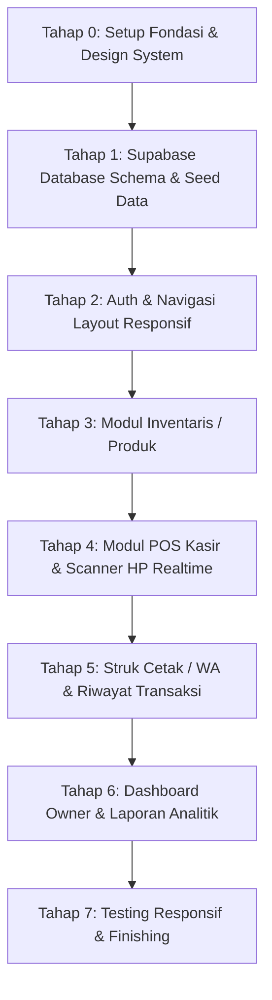

# 🔄 WORKFLOW PENGEMBANGAN TOKOKU POS & INVENTARIS

Peta alur kerja pengembangan berbasis **Schema-First Foundation & Test-Driven Verification**:

---

## 📚 DOKUMENTASI TERKAIT (INTERLINKED CONTEXT)
- 🏗️ **Arsitektur Lengkap:** [RANCANGAN_ARSITEKTUR_TOKOKU.md](file:///c:/Users/dalvi/OneDrive/Desktop/Tugas%20Kuliah/Semester%203/Sistem%20Informasi/Tugas/TokoKu/docs/RANCANGAN_ARSITEKTUR_TOKOKU.md)
- 📋 **Daftar Tugas & Testing (TDD):** [BREAKDOWN_TUGAS_DAN_TESTING.md](file:///c:/Users/dalvi/OneDrive/Desktop/Tugas%20Kuliah/Semester%203/Sistem%20Informasi/Tugas/TokoKu/docs/BREAKDOWN_TUGAS_DAN_TESTING.md)
- 🐙 **Panduan Git & GitHub:** [PANDUAN_GIT_GITHUB.md](file:///c:/Users/dalvi/OneDrive/Desktop/Tugas%20Kuliah/Semester%203/Sistem%20Informasi/Tugas/TokoKu/docs/guides/PANDUAN_GIT_GITHUB.md)
- ⚡ **Panduan Setup Supabase:** [PANDUAN_SETUP_SUPABASE.md](file:///c:/Users/dalvi/OneDrive/Desktop/Tugas%20Kuliah/Semester%203/Sistem%20Informasi/Tugas/TokoKu/docs/guides/PANDUAN_SETUP_SUPABASE.md)
- 👑 **Prinsip Pengembangan AI:** [PRINSIP_PENGEMBANGAN_AI.md](file:///c:/Users/dalvi/OneDrive/Desktop/Tugas%20Kuliah/Semester%203/Sistem%20Informasi/Tugas/TokoKu/docs/guides/PRINSIP_PENGEMBANGAN_AI.md)
- 🎨 **Referensi Desain Visual:** [Design Reference Folder](file:///c:/Users/dalvi/OneDrive/Desktop/Tugas%20Kuliah/Semester%203/Sistem%20Informasi/Tugas/TokoKu/Design%20Reference)
- 📜 **Konteks Master:** [MASTER_PROJECT_CONTEXT.md](file:///c:/Users/dalvi/OneDrive/Desktop/Tugas%20Kuliah/Semester%203/Sistem%20Informasi/Tugas/TokoKu/MASTER_PROJECT_CONTEXT.md)

---

## RINGKASAN TAHAPAN (100% SELESAI):
* ✅ **Tahap 0 — Project Setup & Design System Tokens:** Inisialisasi Next.js TypeScript, Tailwind CSS, konfigurasi warna solid (Sage Green `#6FA084`, Soft Beige `#F4F4F0`, Dark Charcoal `#2C2C2C`, tanpa gradien), dan instalasi komponen Shadcn UI dasar.
* ✅ **Tahap 1 — Database Schema & Realistic Seed Data:** Menyiapkan script SQL migration Supabase untuk 6 tabel, relasi, RLS, dan RPC checkout atomik. Memasukkan data awal (seed) produk khas warung kelontong Indonesia.
* ✅ **Tahap 2 — Auth & Shell Layout:** Login sederhana dengan Role (pemilik vs kasir). Sticky Sidebar untuk desktop, dan Collapsible Drawer/Sheet untuk mobile.
* ✅ **Tahap 3 — Modul Inventaris (`/inventaris`):** CRUD Produk dengan kalkulasi margin otomatis & pembulatan kelipatan 500, Kategori, Supplier dengan checklist pasokan & modal lihat produk, serta Stock Opname.
* ✅ **Tahap 4 — Modul POS (`/pos`) & Scanner Realtime (`/scan`):** Split-screen layout POS, katalog produk, keranjang belanja Zustand, quick cash buttons, F2 checkout shortcut, receipt thermal preview & WA share, serta kamera barcode HP nirkabel via Supabase Realtime broadcast.
* ✅ **Tahap 5 — Cetak Struk, Integrasi WhatsApp, & Riwayat (`/riwayat`):** CSS thermal print 58mm `@media print`, direct link `wa.me`, tabel riwayat transaksi responsif, dan pembatalan transaksi dengan auto-restock stok barang.
* ✅ **Tahap 6 — Dashboard Ringkasan & Laporan (`/dashboard` & `/laporan`):** Kartu KPI penjualan hari ini, peringatan stok menipis, grafik pendapatan harian, grafik tren bulanan historis 2025–2026, analisis 8 produk terlaris, proporsi kategori, dan ekspor spreadsheet Excel/CSV UTF-8 BOM.
* ✅ **Tahap 7 — Testing & Polishing:** Verifikasi otomatis menyeluruh (427+ transaksi lintas tahun 2025–2026, 70 SKU produk, 8 kategori, 7 supplier), perbaikan SSR hydration, dan build produksi Next.js 16 (Turbopack) 100% sukses.
