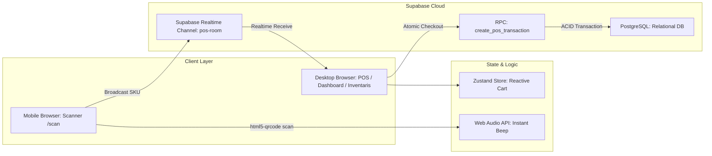

# 🏗️ RANCANGAN ARSITEKTUR LENGKAP SISTEM TOKOKU POS & INVENTORY

Dokumen ini merangkum seluruh kesepakatan rancangan teknis, arsitektur data, alur bisnis, dan aturan antarmuka untuk aplikasi **TokoKu**. Dokumen ini menjadi pedoman utama (single source of truth) selama proses pengembangan.

---

## 1. VISI & RUANG LINGKUP PROYEK
* **Tujuan Utama:** Mengubah operasional pencatatan kasir dan inventaris warung kelontong tradisional menjadi digital, cepat, berbiaya nol (*zero-cost* hosting), dan terintegrasi pemindai barcode HP secara *real-time*.
* **Pengguna Utama:** 
  1. **Pemilik Toko (Owner):** Akses penuh ke seluruh menu (`/dashboard`, `/pos`, `/inventaris`, `/riwayat`, `/laporan`).
  2. **Kasir (Cashier):** Akses terbatas hanya ke terminal kasir (`/pos`) dan riwayat penjualan (`/riwayat`).

---

## 2. ATURAN DESAIN VISUAL (STRICT FLAT MINIMALIST)
Berdasarkan referensi desain di `Design Reference/` dan `StitchAI_POS_Prompts.md`:

* ⛔ **ATURAN MUTLAK:** **TIDAK ADA GRADIEN SAMA SEKALI (ZERO GRADIENTS).** Semua warna adalah *solid, flat, dan matte*. Tidak ada bayangan mencolok (*no heavy shadows*), tidak ada efek kaca (*no glassmorphism*).
* **Palet Warna Utama:**
  - `Page Background`: `#F4F4F0` (Light Cream / Soft Warm Beige)
  - `Card / Surface`: `#FFFFFF` (Pure White, border-radius 12px–16px)
  - `Primary Accent`: `#6FA084` (Solid Sage Green)
  - `Primary Accent Hover`: `#5A8A6F` (Darker Sage Green)
  - `Sidebar Background`: `#2C2C2C` (Dark Charcoal, lebar tetap 220px di desktop)
  - `Primary Text`: `#1A1A1A` (Near Black)
  - `Secondary Text`: `#6B7280` (Cool Grey)
  - `Border / Divider`: `#E5E5E0` (Subtle Light Grey)
  - `Alert / Danger`: `#D64545` (Solid Red)
  - `Warning / Low Stock`: `#E8A838` (Solid Amber)
  - `Success / In Stock`: `#6FA084` (Solid Sage Green)
* **Tipografi:** Menggunakan font modern sans-serif **Inter**.
* **Responsivitas:**
  - **Desktop (Utama):** 1440x900px atau 1920x1080px (Split screen 60% katalog & 40% cart).
  - **Mobile:** 360px–430px (Sidebar berubah menjadi Drawer/Sheet, tabel bertransformasi menjadi kartu data responsif).

---

## 3. ARSITEKTUR TEKNOLOGI & DATA

### A. Komunikasi Realtime Pemindai HP ke POS Desktop:
1. Layar POS desktop memiliki tombol *"Hubungkan Scanner HP"* yang memunculkan QR Code modal dengan URL: `https://domain/scan?room={roomId}`.
2. Kasir membuka kamera HP dan scan QR Code tersebut.
3. Halaman `/scan` di HP mengaktifkan kamera dengan library `html5-qrcode`.
4. Setiap barcode yang terdeteksi memicu:
   - Suara "Beep" instan lewat Web Audio API synthesizer di HP.
   - Mengirim event pesan `{ sku: "899..." }` ke Supabase Realtime Channel `pos-room-{roomId}`.
5. POS desktop yang mendengarkan channel tersebut langsung mencari produk dengan SKU tersebut dan memasukkannya ke keranjang belanja Zustand.
6. Jika barcode rusak, kasir cukup mengetik nama barang di kolom pencarian desktop POS.

### B. Transaksi Kasir Atomik (ACID):
* Checkout tidak dilakukan dengan beberapa query terpisah di client, melainkan memanggil fungsi SQL Stored Procedure (`RPC`) di PostgreSQL Supabase.
* Fungsi ini:
  1. Mengunci baris produk (`SELECT ... FOR UPDATE`) untuk mencegah *race condition*.
  2. Mengecek apakah stok mencukupi (jika stok 0, produk tidak dapat dibeli).
  3. Memasukkan data transaksi ke tabel `transactions`.
  4. Memasukkan detail item ke tabel `transaction_details`.
  5. Mengurangi `current_stock` pada tabel `products`.
  6. Mengembalikan invoice dan status sukses ke kasir dalam satu transaksi database yang utuh.

### C. Alur Pembayaran & POS:
* **Barang Tanpa Barcode:** Memiliki kode internal (misal `PRD-001`). Kasir mencari lewat kotak pencarian atau mengklik langsung kartu produk di katalog POS.
* **Fitur Diskon:** DITIADAKAN / DIHAPUS sesuai arahan Dalvin agar sistem kasir fokus, cepat, dan anti ribet.
* **Pembayaran Tunai:** Tombol nominal cepat (`Rp 5.000`, `Rp 10.000`, `Rp 20.000`, `Rp 50.000`, `Rp 100.000`, `Uang Pas`) + input manual uang diterima. Jika uang diterima kurang dari total belanja, tombol "BAYAR" wajib dinonaktifkan (disabled).
* **Pembayaran QRIS:** Pelanggan memindai lembaran QRIS fisik yang sudah terpasang di meja kasir. Pelanggan memasukkan nominal dan menunjukkan bukti transfer ke kasir. Kasir mengklik tombol "BAYAR" sebagai konfirmasi lunas (tanpa hitungan kembalian).

### D. Fitur Laporan & Produk Terlaris (Best Sellers):
* Sistem secara otomatis menghitung dan mengurutkan **Barang Terlaris (Best Sellers)** berdasarkan agregasi total quantity pada `transaction_details`.
* Muncul di widget halaman `/laporan` peringkat 1 sampai 8 lengkap dengan jumlah terjual (pcs/unit) dan grafik tren pendapatan.

---

## 4. RELASI DATABASE (6 TABEL UTAMA)
1. `users`:
   - `id` (UUID, Primary Key)
   - `username` (Text, Unique) - default: `pemilik` dan `kasir`
   - `password_hash` (Text)
   - `role` (Enum: 'pemilik', 'kasir')
   - `created_at` (Timestamp)
2. `categories`:
   - `id` (UUID, Primary Key)
   - `name` (Text, Unique)
   - `created_at` (Timestamp)
3. `suppliers`:
   - `id` (UUID, Primary Key)
   - `name` (Text)
   - `phone` (Text)
   - `address` (Text)
   - `created_at` (Timestamp)
4. `products`:
   - `id` (UUID, Primary Key)
   - `sku` (Text, Unique / Barcode)
   - `name` (Text)
   - `category_id` (UUID, References categories.id)
   - `supplier_id` (UUID, References suppliers.id, Nullable)
   - `buy_price` (Numeric)
   - `sell_price` (Numeric)
   - `current_stock` (Integer)
   - `minimum_stock` (Integer, Default 5)
   - `unit` (Text, default 'pcs', 'botol', 'bungkus', 'kg', dll.)
   - `image_url` (Text, Nullable - jika null pakai icon kategori)
   - `is_active` (Boolean, Default true)
   - `created_at` (Timestamp)
5. `transactions`:
   - `id` (UUID, Primary Key)
   - `invoice_number` (Text, Unique, Indexed)
   - `user_id` (UUID, References users.id)
   - `total_amount` (Numeric)
   - `payment_method` (Enum: 'Tunai', 'QRIS')
   - `cash_received` (Numeric, Nullable)
   - `cash_change` (Numeric, Nullable)
   - `customer_phone` (Text, Nullable, untuk struk WA)
   - `status` (Enum: 'Selesai', 'Dibatalkan')
   - `created_at` (Timestamp, Indexed)
6. `transaction_details`:
   - `id` (UUID, Primary Key)
   - `transaction_id` (UUID, References transactions.id on delete cascade)
   - `product_id` (UUID, References products.id)
   - `quantity` (Integer)
   - `unit_price` (Numeric)
   - `subtotal` (Numeric)
