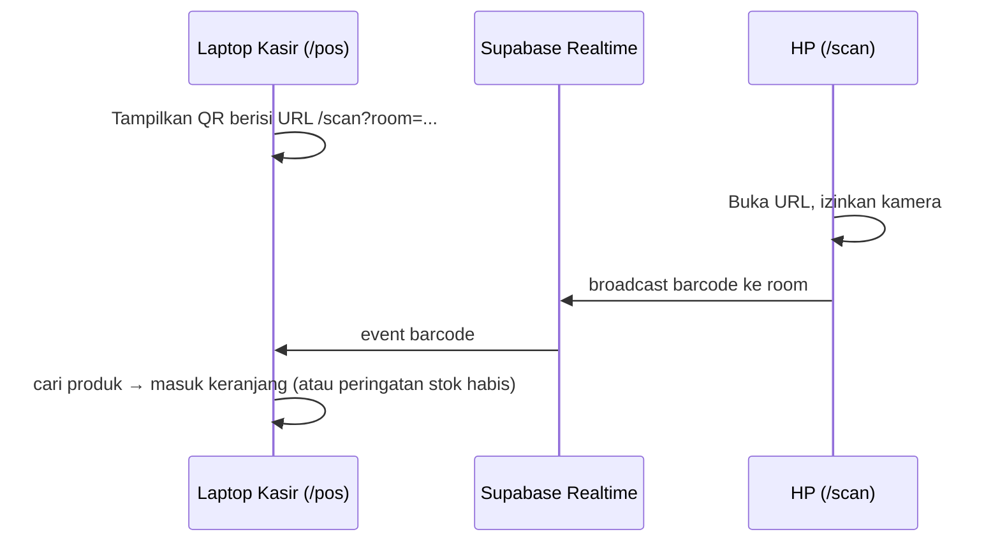

# 🧭 01 — PLAYBOOK LENGKAP: MEMBANGUN APLIKASI DENGAN AI AGENT (FASE 0 – 17)

> Setiap fase berisi: **Tujuan → Kenapa penting → Langkah → Output (file yang harus ada) → Checklist → Contoh nyata dari TokoKu → Jebakan yang perlu dihindari.**
>
> Prompt siap pakai untuk tiap fase ada di [`02_TEMPLATE_PROMPT_DAN_FILE.md`](./02_TEMPLATE_PROMPT_DAN_FILE.md).

---

## Daftar Isi

- [Fase 0 — Mindset & Pembagian Peran](#fase-0--mindset--pembagian-peran)
- [Fase 1 — Ide Mentah → Master Project Context](#fase-1--ide-mentah--master-project-context)
- [Fase 2 — Brainstorm & Interview oleh AI](#fase-2--brainstorm--interview-oleh-ai)
- [Fase 3 — Memilih Tech Stack dengan Alasan](#fase-3--memilih-tech-stack-dengan-alasan)
- [Fase 4 — Referensi Desain & Design System](#fase-4--referensi-desain--design-system)
- [Fase 5 — Rancangan Arsitektur](#fase-5--rancangan-arsitektur)
- [Fase 6 — Workflow / Roadmap Tahapan](#fase-6--workflow--roadmap-tahapan)
- [Fase 7 — Breakdown Tugas Kecil + Kriteria Uji](#fase-7--breakdown-tugas-kecil--kriteria-uji)
- [Fase 8 — Aturan Operasional AI (AGENTS.md)](#fase-8--aturan-operasional-ai-agentsmd)
- [Fase 9 — Setup Git, GitHub & Kebijakan Commit](#fase-9--setup-git-github--kebijakan-commit)
- [Fase 10 — Setup Environment & Backend](#fase-10--setup-environment--backend)
- [Fase 11 — Siklus Eksekusi per Tahap](#fase-11--siklus-eksekusi-per-tahap)
- [Fase 12 — Menguji & Memberi Feedback ke AI](#fase-12--menguji--memberi-feedback-ke-ai)
- [Fase 13 — Data Dummy Realistis & Pengujian Menyeluruh](#fase-13--data-dummy-realistis--pengujian-menyeluruh)
- [Fase 14 — Autentikasi & Security Review](#fase-14--autentikasi--security-review)
- [Fase 15 — Deploy & Uji di Perangkat Asli](#fase-15--deploy--uji-di-perangkat-asli)
- [Fase 16 — Kebersihan Repo & Dokumentasi Akhir](#fase-16--kebersihan-repo--dokumentasi-akhir)
- [Fase 17 — Perawatan, Sesi Chat Baru & Proyek Berikutnya](#fase-17--perawatan-sesi-chat-baru--proyek-berikutnya)
- [Lampiran A — Definition of Done (DoD) Universal](#lampiran-a--definition-of-done-dod-universal)
- [Lampiran B — Matriks Verifikasi Masalah](#lampiran-b--matriks-verifikasi-masalah)
- [Lampiran C — Standar Ukuran Font, Spasi & Responsif](#lampiran-c--standar-ukuran-font-spasi--responsif)
- [Lampiran D — Cheatsheet Perintah CLI & Terminal Cepat](#lampiran-d--cheatsheet-perintah-cli--terminal-cepat)
- [Lampiran E — Filosofi Pengembangan Kolaboratif Manusia & AI](#lampiran-e--filosofi-pengembangan-kolaboratif-manusia--ai)

---

## Fase 0 — Mindset & Pembagian Peran

### Tujuan
Menyepakati siapa melakukan apa, supaya kamu tidak kelelahan dan AI tidak berjalan liar.

### Kenapa Penting
Membangun aplikasi "full AI" bukan berarti kamu pasif. Di TokoKu, kualitas terbaik muncul justru ketika kamu aktif: menjawab pertanyaan, mengoreksi jam yang berdetik tiap detik ("terlalu berat, per menit saja"), menolak dropdown yang kuno, dan meminta harga dibulatkan ke `.000`/`.500`. AI cepat menulis kode, tapi **kamu yang tahu dunia nyata penggunanya**.

### Pembagian Peran yang Ideal

| Peran | Kamu (Product Owner + Reviewer) | AI Agent (Engineer + Dokumentator) |
|-------|-------------------------------|-------------------------------------|
| Visi & prioritas | ✅ Menentukan | Memberi opsi + rekomendasi |
| Aturan bisnis | ✅ Menentukan (contoh: stok habis tidak bisa dijual) | Menerjemahkan ke kode & database |
| Desain | ✅ Memberi referensi & selera | Membuat design system, konsisten di semua halaman |
| Tech stack | Menyetujui | ✅ Mengusulkan dengan alasan |
| Koding | — | ✅ Menulis, menguji, memperbaiki |
| Verifikasi | ✅ Uji manual sebagai pengguna | ✅ Build, lint, test, cek browser |
| Dokumentasi | Membaca & mengoreksi | ✅ Menulis & memperbarui |
| Git | Setup awal akun | ✅ Commit & push otomatis |
| Keputusan berisiko (hapus data, deploy, keamanan) | ✅ Wajib menyetujui | Wajib bertanya dulu |

### Prinsip Mental
- **AI itu sangat percaya diri, bahkan ketika salah.** Kalimat seperti "100% tuntas" bukan bukti. Minta bukti.
- **Konteks AI hilang di setiap chat baru** (dan bahkan bisa terpotong di chat yang sangat panjang). Semua yang penting harus hidup di file.
- **Kamu boleh tidak paham kode, tapi harus paham perilaku aplikasi.** Uji seperti pemilik warung yang sibuk, bukan seperti programmer.

### Checklist
- [ ] Saya paham bahwa saya adalah penentu keputusan, AI adalah pelaksana + penasihat.
- [ ] Saya siap menjawab banyak pertanyaan di awal (ini investasi, bukan buang waktu).
- [ ] Saya siap menguji setiap tahap sendiri di browser.

---

## Fase 1 — Ide Mentah → Master Project Context

### Tujuan
Menuangkan ide ke satu dokumen pusat yang menjelaskan **apa, untuk siapa, kenapa, dan batasannya**.

### Kenapa Penting
Di TokoKu, prompt pertama dimulai dengan `@MASTER_PROJECT_CONTEXT.md` — artinya kamu sudah menyiapkan ide tertulis sebelum ngobrol dengan AI. Ini membuat diskusi langsung fokus, bukan menebak-nebak.

### Isi Minimum `MASTER_PROJECT_CONTEXT.md`
1. **Nama & satu kalimat deskripsi** — "TokoKu: sistem kasir & inventaris untuk warung kelontong."
2. **Masalah yang diselesaikan** — pencatatan manual, stok tidak terpantau, nota hilang.
3. **Pengguna & peran** — Pemilik (akses penuh), Kasir (transaksi & riwayat).
4. **Fitur utama (MoSCoW):**
   - *Must:* POS, inventaris, riwayat nota.
   - *Should:* scan barcode via HP, laporan, ekspor.
   - *Could:* struk digital via WhatsApp.
   - *Won't (untuk sekarang):* diskon, pajak, multi-cabang.
5. **Aturan bisnis penting** — barang tanpa barcode cukup dicari manual; pembulatan harga; stok tidak boleh minus.
6. **Batasan** — gratis (free tier), dikerjakan AI, perangkat yang dipakai (laptop kasir + HP).
7. **Referensi desain** — lokasi folder gambar.
8. **Ukuran sukses** — contoh: transaksi selesai < 10 detik, tidak ada stok minus.

### Checklist
- [ ] Ada daftar fitur yang jelas dibagi Must/Should/Could/Won't.
- [ ] Ada daftar peran pengguna dan hak aksesnya.
- [ ] Ada aturan bisnis yang tidak boleh dilanggar.
- [ ] Ada bagian "Won't" — ini mencegah AI menambah fitur sendiri.

### Jebakan
- ❌ Menulis ide terlalu umum ("aplikasi kasir modern"). AI akan mengisi kekosongan dengan asumsinya sendiri.
- ❌ Tidak menulis yang *tidak* diinginkan. Di TokoKu, fitur diskon sempat masuk desain lalu harus dihapus.

---

## Fase 2 — Brainstorm & Interview oleh AI

### Tujuan
Membuat AI memahami konteks **sedalam mungkin** sebelum satu baris kode ditulis.

### Kenapa Penting
Ini fase dengan ROI (hasil vs usaha) tertinggi di seluruh proyek. Setiap jawaban di sini menghemat berjam-jam revisi nanti. Di TokoKu kamu menulis: *"aku ingin kamu benar-benar menanyakan aku sebanyak-banyaknya… 30 pertanyaan juga silakan, 50 pertanyaan juga ayo, nanti kasih rekomendasi jawabannya juga."* — dan hasilnya terlihat jelas.

### Langkah
1. Beri AI file Master Context + folder desain.
2. Tegaskan: **jangan mengerjakan apa pun dulu.**
3. Minta AI mengevaluasi ide & tech stack dengan alasan.
4. Minta AI bertanya dalam bentuk daftar bernomor, **setiap pertanyaan disertai rekomendasi jawaban**.
5. Jawab dengan nomor yang sama. Boleh menjawab "ikuti rekomendasimu" untuk yang kamu tidak paham.
6. Ulangi putaran tanya-jawab sampai AI tidak punya pertanyaan penting lagi (biasanya 2–4 putaran).
7. Minta AI **merangkum semua keputusan ke file** (Master Context / Arsitektur).

### Contoh Keputusan Nyata dari Interview TokoKu

| Pertanyaan AI | Jawaban Dalvin | Dampak ke Sistem |
|---------------|----------------|------------------|
| Barang tanpa barcode bagaimana? | Cukup dicari manual di kasir, jangan dibuat ribet | Tidak perlu generator barcode untuk semua barang; fokus ke pencarian cepat |
| Ada fitur diskon? | Belum, hapus dulu | Kolom & UI diskon dihapus → scope lebih kecil |
| Tombol nominal uang? | Jalan pintas, tapi input tetap bisa diketik manual | Quick cash buttons + input manual |
| QRIS bagaimana? | Kertas QRIS tercetak, tombol bayar = konfirmasi | Tidak perlu integrasi payment gateway |
| Tombol bayar saat uang kurang? | Wajib nonaktif | Validasi `isPaymentValid` |
| Barcode rusak? | Kasir cari manual | Tidak perlu fitur khusus |
| Suara beep? | Web Audio API (tanpa file MP3) | Ringan, tanpa aset |
| Foto produk? | Opsional, fallback ikon kategori | Tidak perlu storage gambar wajib |
| Satuan? | Dropdown: pcs, botol, bungkus, renteng, kg, liter, dus, kaleng… | Enum satuan |
| Barang datang (kulakan)? | Input jumlah akhir, tampil selisih `+4` | Desain Stock Opname dengan indikator selisih & tombol +1/+5 |
| Pembatalan transaksi? | Hanya Pemilik, stok otomatis kembali | RPC pembatalan + RBAC |
| Pajak? | 0% | Tidak ada perhitungan pajak |
| Lebar struk? | 58mm (tetap rapi di 80mm) | CSS print 58mm |
| Stok habis? | Kartu tidak bisa diklik, scan HP muncul peringatan | Proteksi stok minus di UI + database |
| Kategori awal? | Minuman, Mie Instan, Snack, Sembako & Bumbu, Rumah Tangga, ATK & Rokok | Seed kategori |

### Checklist
- [ ] AI sudah bertanya minimal satu putaran besar (≥ 15 pertanyaan).
- [ ] Setiap pertanyaan punya rekomendasi jawaban.
- [ ] Semua jawaban sudah dirangkum ke file, bukan hanya di chat.
- [ ] Ada daftar "fitur yang dihapus/ditunda" yang tertulis.

### Jebakan
- ❌ Langsung bilang "kerjakan saja" karena tidak sabar.
- ❌ Menjawab di chat tapi tidak meminta AI menyimpan ke file → hilang di chat berikutnya.
- ❌ Menerima semua rekomendasi AI tanpa membaca. Rekomendasi itu titik awal, bukan keputusan.

---

## Fase 3 — Memilih Tech Stack dengan Alasan

### Tujuan
Memilih teknologi yang **cocok untuk masalahnya** dan **dikuasai baik oleh AI**, bukan yang sedang tren.

### Kriteria Penilaian

| Kriteria | Pertanyaan | Kenapa Penting untuk Proyek AI |
|----------|-----------|-------------------------------|
| Kecocokan masalah | Apakah butuh realtime? transaksi atomik? offline? | Menentukan database & arsitektur |
| Popularitas | Apakah banyak contoh & dokumentasi? | AI lebih akurat di teknologi populer |
| Biaya | Ada free tier yang cukup? | Proyek kuliah/UMKM |
| Kemudahan deploy | Bisa 1-klik ke Vercel/Netlify? | Mengurangi pekerjaan DevOps |
| Type safety | TypeScript? | Error tertangkap saat build, bukan saat dipakai |
| Stabilitas versi | Apakah versi terbaru punya breaking changes? | AI sering menulis kode untuk versi lama |
| Ekosistem UI | Ada library komponen siap pakai? | Mempercepat UI konsisten |

### Stack TokoKu & Alasannya

| Lapisan | Pilihan | Alasan |
|---------|---------|--------|
| Framework | **Next.js (App Router) + TypeScript** | Satu proyek untuk halaman & logika; deploy mudah ke Vercel; TypeScript menangkap error lebih awal |
| Styling | **Tailwind CSS (v4, token via `@theme`)** | Cepat, konsisten, token warna terpusat |
| Komponen | **Shadcn-style UI** (komponen di dalam repo) | Bisa dimodifikasi bebas, bukan library tertutup |
| State | **Zustand** (+ `persist`) | Ringan untuk keranjang kasir & sesi |
| Database | **Supabase (PostgreSQL)** | SQL sungguhan, gratis, ada dashboard |
| Transaksi atomik | **PostgreSQL RPC (stored function)** | Checkout + potong stok dalam satu transaksi → tidak ada stok minus walau dua kasir bersamaan |
| Realtime | **Supabase Realtime Channels** | Scanner HP mengirim barcode ke laptop kasir secara langsung (QR pairing) |
| Ekspor gambar | **html-to-image** | Struk digital PNG ala bank |
| Hosting | **Vercel** | Gratis, auto-deploy setiap `git push` |

### Langkah
1. Minta AI menilai stack yang kamu usulkan + memberi alternatif dengan tabel pro/kontra.
2. Putuskan, lalu tulis keputusannya + alasannya di dokumen arsitektur.
3. Minta AI **langsung menginstal** dependency lewat CLI (kamu sempat meminta ini, dan itu tepat).
4. Catat versi penting (contoh: Next.js 16.x) — **versi baru sering berbeda dari yang diingat AI.**

### Jebakan
- ❌ "Pakai yang paling canggih walau tidak beginner friendly karena AI yang mengerjakan." Sebagian benar — tapi saat ada bug aneh, kamu tetap perlu membaca pesan error. Pilih yang canggih **dan** populer.
- ❌ Tidak menulis versi. Di TokoKu, `AGENTS.md` memuat catatan bahwa Next.js versi ini punya perubahan besar dan AI harus membaca dokumentasi di `node_modules/next/dist/docs/` — ini kebiasaan bagus untuk semua framework yang cepat berubah.
- ❌ Ide "pakai alat X agar AI selalu tahu konteks" (contoh: plugin graph/Obsidian) tanpa memastikan alat itu benar-benar dibaca oleh agent yang kamu pakai. Yang **pasti** dibaca adalah file aturan di lokasi resmi (`.agents/`, `AGENTS.md`) dan file yang ditautkan dari sana.

---

## Fase 4 — Referensi Desain & Design System

### Tujuan
Membuat semua halaman terlihat seperti satu aplikasi yang sama, dan memberi AI "kamus visual" yang tidak bisa disalahartikan.

### Kenapa Penting
Banyak feedback di TokoKu adalah soal desain: kartu yang teksnya mepet ke atas, dropdown kuno tanpa radius, teks "2 produk" terlalu kecil, ikon kartu yang tidak sejajar dengan judul, dropdown bagus di satu halaman tapi tidak dipakai di halaman lain. Hampir semua itu bisa dicegah dengan design system yang lengkap **sebelum** koding.

### Isi `PANDUAN_DESIGN_SYSTEM.md` yang Lengkap
1. **Filosofi desain** — contoh TokoKu: flat, bersih, tanpa gradien sama sekali.
2. **Token warna** (nama + hex + kegunaan):
   - Primary Sage Green `#6FA084` (aksi utama, hover teks dropdown)
   - Background Cream `#F4F4F0`
   - Surface `#FFFFFF`
   - Sidebar Charcoal `#2C2C2C`
   - Teks utama `#1A1A1A`, teks sekunder `#6B7280`, border `#E5E5E0`, danger `#D64545`, warning `#E8A838`
3. **Tipografi** — font (Inter), skala ukuran per peran (lihat Lampiran C).
4. **Spasi & radius** — kelipatan 4px, radius kartu `rounded-2xl`, tombol `rounded-xl`.
5. **Komponen standar** — Button (primary/outline/ghost/danger), Input, **Select/Dropdown standar**, Modal, Card KPI, Tabel, Badge status, Toast, Empty state.
6. **State setiap komponen** — default, hover, focus, disabled, loading, error, empty.
7. **Pola layout** — sidebar, header 64px, grid kartu, tabel dengan kolom aksi (lihat/edit/hapus).
8. **Aturan responsif** — breakpoint, perilaku tabel di layar kecil, tinggi modal maksimum.
9. **Larangan** — contoh: *ZERO GRADIENTS*, jangan pakai warna hex langsung kalau sudah ada token.

### Langkah
1. Kumpulkan referensi gambar (mockup buatan sendiri, Stitch AI, Dribbble) di folder `Design Reference/`.
2. Tanyakan AI: *"Apakah kamu bisa melihat gambar-gambar ini?"* — pastikan benar terbaca.
3. Minta AI membuat design system **lengkap** (kamu memintanya di TokoKu: "aku benar-benar ingin selengkap itu").
4. Daftarkan token di konfigurasi Tailwind/CSS dan **wajibkan pemakaian token** di kode.
5. Tegaskan: *"Desainku gambaran besar. Kalau ada fitur/tombol yang kurang agar UX masuk akal, tambahkan dan beri tahu aku."*

### Jebakan
- ❌ Token didefinisikan tapi kode tetap memakai `text-[#6B7280]`. Akibatnya muncul ratusan peringatan kuning "can be written as `text-tokoku-text-secondary`" di editor. Lebih baik pakai token dari awal daripada mematikan peringatannya.
- ❌ Memperbaiki komponen di satu halaman saja. Minta selalu: *"Terapkan ke semua halaman dan catat di design system."*
- ❌ Lupa menguji di skala tampilan Windows 125–150%. Modal TokoKu terpotong di laptop 1920×1080 scaling 150%.

---

## Fase 5 — Rancangan Arsitektur

### Tujuan
Menulis "cetak biru" teknis: data apa yang disimpan, bagaimana alirannya, siapa boleh apa.

### Isi `RANCANGAN_ARSITEKTUR.md`
1. **Diagram entitas (ERD)** — contoh TokoKu: `users`, `categories`, `suppliers`, `products`, `transactions`, `transaction_details`, (riwayat stok).
2. **Relasi** — produk ↔ kategori, produk ↔ supplier. *(Pelajaran: relasi supplier–produk awalnya tidak bisa diisi dari form supplier — pikirkan relasi dari sisi UX: "bagaimana pemilik tahu supplier ini memasok apa?")*
3. **Fungsi database / RPC** — kontrak input-output, contoh `checkout` atomik & `cancel_transaction` yang mengembalikan stok.
4. **Aturan keamanan (RLS)** — siapa boleh baca/tulis tabel apa.
5. **Peran & hak akses (RBAC)** — tabel halaman × peran.
6. **Alur utama (sequence)** — checkout, scan HP → laptop, pembatalan.
7. **Struktur folder kode** — `app/`, `components/`, `services/`, `stores/`, `lib/`, `types/`.
8. **Aturan bisnis terpusat** — contoh fungsi `roundPrice500()` dipakai di semua tempat, bukan dihitung ulang di tiap halaman.
9. **Keputusan & alasannya (ADR singkat)** — kenapa RPC, kenapa Realtime, dsb.

### Contoh Alur yang Patut Ditiru (Scanner HP TokoKu)


### Checklist
- [ ] Setiap fitur Must punya tabel/kolom yang mendukungnya.
- [ ] Operasi yang mengubah banyak tabel sekaligus dibuat atomik (RPC/transaction).
- [ ] Ada tabel hak akses per peran.
- [ ] Aturan bisnis numerik (pembulatan, pajak, kembalian) punya satu fungsi pusat.

---

## Fase 6 — Workflow / Roadmap Tahapan

### Tujuan
Menentukan urutan pengerjaan yang meminimalkan bongkar-pasang.

### Backend Dulu atau Frontend Dulu?
**Jawaban terbaik: bukan keduanya — tapi *vertical slice*.** Kerjakan per modul dari database sampai tampilan, lalu uji. Dengan begitu setiap tahap menghasilkan sesuatu yang benar-benar bisa dipakai.

### Roadmap TokoKu (Bisa Dijadikan Pola)

| Tahap | Isi | Hasil yang Bisa Diuji |
|-------|-----|----------------------|
| 0 | Fondasi: init proyek, design token, komponen dasar, Git | Halaman kosong bergaya benar, build lolos |
| 1 | Database: schema, seed, RPC, koneksi `.env` | Data terbaca dari Supabase |
| 2 | Layout & peran: sidebar, header, RBAC | Navigasi jalan, kasir tidak bisa buka halaman pemilik |
| 3 | Inventaris: produk, kategori, supplier, stock opname | CRUD lengkap |
| 4 | POS kasir + scanner HP | Transaksi tersimpan, stok terpotong |
| 5 | Riwayat transaksi + pembatalan | Cari, filter, lihat detail, batal → stok kembali |
| 6 | Laporan + ekspor | Grafik, KPI, unduh file |
| 7 | Pengujian menyeluruh & polishing | Semua alur lolos, data dummy realistis |
| 8 *(seharusnya ada)* | Auth sungguhan & security review | Login aman, RLS ketat |
| 9 *(seharusnya ada)* | Deploy & uji perangkat | URL publik, HP bisa scan |

> 💡 Di TokoKu, login baru dibuat setelah Tahap 7 dan deploy dibahas belakangan. Untuk proyek berikutnya, **taruh auth di awal (setelah layout)** dan **security review sebelum deploy** sebagai tahap resmi.

### Checklist
- [ ] Setiap tahap menghasilkan fitur yang bisa diklik dan diuji.
- [ ] Ada tahap khusus untuk auth/keamanan dan deploy.
- [ ] Ada tahap pengujian menyeluruh di akhir.

---

## Fase 7 — Breakdown Tugas Kecil + Kriteria Uji

### Tujuan
Memecah tiap tahap menjadi tugas kecil yang masing-masing punya **cara membuktikan bahwa ia selesai**.

### Format Tugas yang Baik
```markdown
- [ ] **4.3 Validasi Pembayaran Tunai**
  - Deskripsi: Tombol Bayar nonaktif jika uang diterima < total.
  - Kriteria selesai:
    1. Total 38.500, uang 20.000 → tombol abu-abu, teks "Kurang Rp 18.500".
    2. Klik "Uang Pas" → tombol aktif, kembalian Rp 0.
    3. Input menampilkan pemisah ribuan (250.000).
  - Cara uji: manual di /pos + `npm run build` + (ideal) unit test fungsi hitung kembalian.
```

### Prinsip
- **Kecil** — selesai dalam satu sesi kerja AI.
- **Bisa diuji** — ada langkah konkret dan hasil yang diharapkan.
- **Berurutan** — tugas yang jadi fondasi dikerjakan dulu.
- **Dicentang** — AI wajib memperbarui checkbox setelah benar-benar terverifikasi.

### Tentang "Tes Dulu Baru Koding" (TDD)
Kamu meminta ini sejak awal — dan itu benar. Namun di TokoKu, verifikasi yang paling banyak dipakai adalah `npm run build` (cek tipe/kompilasi) dan satu skrip verifikasi data. **Itu belum TDD.** Untuk proyek berikutnya, minta di Tahap 0:
- **Vitest** untuk fungsi logika (hitung total, kembalian, pembulatan, validasi stok).
- **Playwright** untuk alur end-to-end (login → tambah ke keranjang → bayar → riwayat muncul).
- Perintah `npm test` wajib hijau sebelum commit.

---

## Fase 8 — Aturan Operasional AI (AGENTS.md)

### Tujuan
Satu file yang otomatis dibaca AI di setiap chat baru, berisi siapa kamu, aturan kerja, dan peta dokumen.

### Kenapa Penting
Kamu bertanya: *"Kalau aku mulai chat di room baru, apakah harus mention file tertentu?"* Jawabannya: tidak, **asalkan** aturan ada di lokasi yang otomatis dibaca agent (untuk Antigravity: folder `.agents/` di root proyek, atau `AGENTS.md`/`GEMINI.md`). Dari sana, AI mengikuti tautan ke dokumen lain.

### Isi Wajib `.agents/AGENTS.md`
1. **Identitas pengguna & sapaan** — "Mulai setiap respons dengan `Dalvin,`".
   - 🎯 *Trik cerdas:* sapaan ini berfungsi sebagai **"canary"** (indikator). Kalau AI di chat baru tidak menyapa namamu, berarti file aturan **tidak terbaca** — segera mention file-nya secara manual.
2. **Peta dokumentasi** — tautan ke Master Context, Workflow, Arsitektur, Breakdown, Design System, Guides.
3. **Kebijakan commit & push otomatis** — format Conventional Commits berbahasa Inggris.
4. **Batasan desain & arsitektur** — contoh: zero gradients, stack yang dipakai.
5. **Aturan klarifikasi** — "Selalu tanya jika ragu, sebanyak apa pun, dengan rekomendasi jawaban. Jangan membuat fitur yang tidak diminta."
6. **Aturan verifikasi** — build + lint + test + cek browser sebelum menyatakan selesai.
7. **Catatan versi framework** — contoh catatan Next.js di TokoKu.

### Satu Sumber Kebenaran
Di TokoKu sempat ada `AGENTS.md`, `GEMINI.md`, dan `.agents/rules/TOKOKU_RULES.md` yang isinya hampir sama. Salinan seperti ini **pasti lama-lama berbeda** (dan memang sudah terjadi: salah satunya masih berisi tautan lama). Rekomendasi:
- Simpan aturan lengkap **hanya** di `.agents/AGENTS.md`.
- Jika butuh `GEMINI.md`, isinya cukup satu baris: "Lihat `.agents/AGENTS.md`."

### Checklist
- [ ] File aturan ada di lokasi resmi yang dibaca agent.
- [ ] Tautan dokumen relatif dan valid setelah file dipindah.
- [ ] Tidak ada salinan aturan ganda.
- [ ] Uji di chat baru: apakah AI menyapa dengan namamu?

---

## Fase 9 — Setup Git, GitHub & Kebijakan Commit

### Langkah Awal (Sekali Saja)
```powershell
git config --global user.name "NamaKamu"
git config --global user.email "email@kamu.com"
git init
git branch -M main
git remote add origin https://github.com/<user>/<repo>.git
```

### Sebelum Commit Pertama — WAJIB
Buat `.gitignore` berisi minimal:
```gitignore
node_modules/
.next/
.env
.env*.local
*.pem
recovery-codes.txt
.vercel
```
> Di TokoKu, file `recovery-codes.txt` sempat berada di root proyek tanpa di-ignore. Untung tertangkap sebelum ter-commit. **Kode pemulihan akun tidak boleh pernah ada di folder proyek** — simpan di password manager.

### Masalah Login Saat Push
Pesan `remote: Invalid username or token` muncul karena GitHub **tidak lagi menerima password akun** untuk push lewat HTTPS. Solusi:
- Login lewat **Git Credential Manager** (jendela browser muncul otomatis di Windows), atau
- Pakai **Personal Access Token (PAT)** sebagai pengganti password, atau
- Install **GitHub CLI** lalu `gh auth login`.

### Kebijakan Commit Otomatis (Conventional Commits, Bahasa Inggris)
| Tipe | Kapan | Contoh |
|------|-------|--------|
| `feat(scope)` | Fitur baru | `feat(pos): add thousand separator to cash input` |
| `fix(scope)` | Perbaikan bug | `fix(history): resolve react hook ordering error #310` |
| `style(scope)` | Tampilan saja | `style(inventory): use canonical color tokens` |
| `refactor(scope)` | Rapikan kode tanpa ubah perilaku | `refactor(cart): extract payment validation` |
| `docs(scope)` | Dokumentasi | `docs(playbook): add AI app-building guide` |
| `test(scope)` | Tes | `test(pos): add checkout e2e test` |
| `chore(scope)` | Konfigurasi/dependency | `chore(deps): add html-to-image` |

### Rekomendasi Tambahan (Level Berikutnya)
- **Satu commit = satu perubahan logis.** Jangan menggabungkan "fitur login + struk PNG + fix modal" dalam satu commit — sulit di-revert kalau salah satunya bermasalah.
- **Tag milestone:** `git tag v0.4-pos-done` setelah tiap tahap besar → mudah kembali ke versi stabil.
- **Branch untuk eksperimen berisiko:** `git checkout -b feat/digital-receipt`, merge ke `main` setelah lolos uji.

---

## Fase 10 — Setup Environment & Backend

### Supabase (atau BaaS Sejenis)
1. Buat project gratis → simpan password database di password manager.
2. Ambil dari **Project Settings → API**:
   - **Project URL** → `https://<ref>.supabase.co` *(tanpa `/rest/v1/` — di TokoKu sempat salah di sini)*
   - **anon / publishable key** → aman dipakai di frontend **hanya jika RLS benar**.
   - **service_role key** → ❌ tidak pernah ditaruh di frontend, tidak pernah di-commit.
3. Isi `.env.local`:
   ```env
   NEXT_PUBLIC_SUPABASE_URL=https://<ref>.supabase.co
   NEXT_PUBLIC_SUPABASE_ANON_KEY=<anon-key>
   ```
4. Jalankan `schema.sql` di SQL Editor. Jika muncul peringatan "destructive operation", baca dulu — itu berarti skrip akan menghapus/menimpa tabel.

### Aturan Skrip SQL yang Baik
- **Idempotent:** bisa dijalankan ulang (`create table if not exists`, `on conflict do nothing`).
- **UUID valid:** hanya karakter hex `0-9a-f`. Di TokoKu, seed `s1111111-…` gagal karena `s` bukan hex.
- **Seed terpisah dari schema** agar data contoh tidak menimpa data asli.
- **RLS diaktifkan di semua tabel** dengan kebijakan eksplisit.

### Menjalankan Aplikasi Lokal
```powershell
npm install
npm run dev        # buka http://localhost:3000
npm run build      # cek kompilasi produksi
```

---

## Fase 11 — Siklus Eksekusi per Tahap

### Siklus Ideal (yang harus dilakukan AI setiap tahap)
```
1. BACA      → AGENTS.md + dokumen tahap terkait + kode yang akan disentuh
2. RENCANA   → daftar file yang akan dibuat/diubah + pendekatan
3. TANYA     → hal yang ambigu (dengan rekomendasi), tunggu jawaban
4. TES DULU  → tulis tes/kriteria uji untuk perilaku yang diharapkan
5. KODING    → implementasi kecil-kecil
6. VERIFIKASI→ typecheck/build + lint + test + cek visual di browser
7. DOKUMEN   → centang breakdown, perbarui arsitektur/design system jika berubah
8. COMMIT    → conventional commit + push
9. LAPOR     → ringkas: apa yang berubah, bukti verifikasi, apa yang belum/berisiko
```

### Peranmu di Setiap Tahap
1. Beri perintah: *"Lanjut Tahap N — [nama]."*
2. Jawab pertanyaan AI.
3. Jalankan `npm run dev`, uji sebagai pengguna.
4. Beri feedback bernomor (Fase 12).
5. Putuskan: perbaiki sekarang atau masuk backlog ("bug fix nanti saja, selesaikan tahap dulu" — keputusan yang sah, asal dicatat).

### Laporan AI yang Baik Harus Memuat
- Daftar file yang diubah (dengan tautan).
- Bukti: output build/test, screenshot.
- **Hal yang belum diverifikasi atau berisiko** — laporan yang semuanya "100% sempurna" patut dicurigai.

---

## Fase 12 — Menguji & Memberi Feedback ke AI

### Template Feedback yang Efektif
```markdown
1. [Halaman Inventaris > Kartu KPI] Teks terlalu mepet ke atas.
   Harapan: padding atas-bawah seimbang. Berlaku untuk SEMUA kartu KPI.
2. [Dropdown] Terlalu polos. Harapan: radius, hover teks hijau sage.
   Jadikan komponen standar & catat di design system.
3. [Modal Nota] Tombol X dan Selesai tidak terlihat.
   Perangkat: 1920×1080, scaling Windows 150%, zoom browser 90%.
   Screenshot: (lampirkan)
```

### Kebiasaan Baik yang Sudah Kamu Lakukan di TokoKu
- ✅ Memberi nomor pada setiap poin.
- ✅ Melampirkan screenshot.
- ✅ Menyebutkan spesifikasi layar & zoom.
- ✅ Meminta perbaikan berlaku global ("berlaku juga untuk lainnya", "selalu terapkan style dropdown itu ke depannya").
- ✅ Memberi contoh dunia nyata (struk bank Jago → resi PNG).
- ✅ Menolak solusi yang tidak praktis di lapangan (WhatsApp Web perlu scan QR → minta Share bawaan).

### Kebiasaan yang Bisa Ditambah
- Tulis **"Harapan"** secara eksplisit, bukan hanya masalahnya.
- Bedakan **bug** (salah) vs **selera** (kurang suka) vs **ide baru** (scope bertambah).
- Simpan ide baru ke `BACKLOG.md` dulu jika sedang di tengah tahap.

---

## Fase 13 — Data Dummy Realistis & Pengujian Menyeluruh

### Kenapa Penting
Aplikasi kosong menyembunyikan bug: grafik, paginasi, filter tanggal, performa — semuanya baru teruji dengan data banyak. Kamu meminta data yang "terlihat seperti sudah berjalan 1–2 tahun", dan itu tepat.

### Resep Data Dummy yang Baik
- **Skrip seed yang bisa diulang** (contoh TokoKu: `scripts/seed_rich_data.ts` → 427 transaksi Okt 2025–Okt 2026, 70 produk, 8 kategori, 7 supplier).
- **Distribusi realistis:** hari ramai/sepi, tren naik, produk laris vs jarang laku, beberapa transaksi dibatalkan, beberapa stok kritis.
- **Patuh aturan bisnis:** harga sudah dibulatkan, stok tidak minus.
- **Skrip verifikasi** setelah seed (contoh: `scripts/verify_all_modules.ts` → cek jumlah baris, distribusi tahun, pembulatan, peringatan stok).

### Pengujian Menyeluruh (Checklist Akhir)
- [ ] Setiap halaman dibuka sebagai **Pemilik** dan sebagai **Kasir**.
- [ ] Alur utama end-to-end: tambah produk → jual → riwayat → batal → stok kembali → laporan berubah.
- [ ] Layar: 1366×768, 1920×1080 @150%, tablet, HP.
- [ ] Data kosong (empty state) dan data banyak.
- [ ] Console browser bersih dari error merah.
- [ ] Ekspor/unduh file benar-benar dibuka dan dicek isinya (bukan hanya "terunduh").

---

## Fase 14 — Autentikasi & Security Review

### Prinsip
- **Tidak ada pendaftaran publik** jika pengguna hanya staf (keputusanmu di TokoKu sudah tepat).
- **Gunakan sistem auth sungguhan** (Supabase Auth / NextAuth), bukan membandingkan password di browser.
- **Password tidak pernah disimpan polos**; tidak pernah bisa dibaca lewat API publik.
- **Default = tidak login.** Pengunjung baru harus diarahkan ke `/login`.
- **Peran dicek di server/database (RLS)**, bukan hanya disembunyikan di UI.
- **Fitur "ganti peran cepat" untuk demo** harus dimatikan di produksi.

### Checklist Security Review Sebelum Deploy
- [ ] Buka aplikasi di jendela Incognito → apakah langsung diarahkan ke login?
- [ ] Bisakah tabel `users` dibaca dengan anon key? (Seharusnya tidak, terutama kolom password.)
- [ ] Bisakah kasir memanggil fungsi pembatalan lewat console browser? (Seharusnya ditolak database.)
- [ ] Apakah ada password/kredensial demo tertulis di kode frontend?
- [ ] Apakah RLS aktif di semua tabel?
- [ ] Apakah `.env`, key rahasia, recovery code tidak ada di Git history?

> ⚠️ Lihat file 03 bagian "Auth TokoKu" — login TokoKu saat ini masih level demo dan **belum layak dipakai publik** sebelum diperbaiki.

---

## Fase 15 — Deploy & Uji di Perangkat Asli

### Vercel (Cara Paling Mudah)
1. Login [vercel.com](https://vercel.com) dengan akun GitHub.
2. **Add New → Project → Import** repositori.
3. Isi **Environment Variables** (sama dengan `.env.local`).
4. Jika muncul tawaran integrasi Supabase: pilih **Link Existing Account** atau lewati. ❌ Jangan "Create New Supabase Account" — itu membuat database baru yang kosong.
5. **Deploy.** Setelahnya, setiap `git push` ke `main` otomatis memperbarui situs.

### Uji Setelah Deploy
- [ ] Buka di HP lewat URL HTTPS (kamera HP hanya bisa diakses di HTTPS atau localhost).
- [ ] Coba scanner HP → barcode masuk ke keranjang laptop.
- [ ] Coba tombol Share/WhatsApp di HP asli (perilaku Web Share berbeda di desktop vs HP).
- [ ] Coba cetak struk 58mm.

---

## Fase 16 — Kebersihan Repo & Dokumentasi Akhir

### Tujuan
Menyusun repositori yang bersih, profesional, berstandar industri, dan siap dipamerkan di portofolio GitHub atau diserahkan ke dosen/klien tanpa jejak file sampah yang membingungkan.

### Kenapa Penting
Selama proses pengembangan yang intensif bersama AI, puluhan file sementara, script tes acak, dan dokumen panduan sering dibuat secara spontan di folder utama (root). Jika dibiarkan berantakan, siapa pun yang membuka repositori (rekruter, dosen, atau rekan satu tim) akan merasa proyek ini tidak terstruktur. Selain itu, meletakkan file internal AI seperti `agents.md` atau `gemini.md` langsung di root membuat proyek terlihat amatir. Dalvin secara cerdas menanyakan hal ini: *"kan gaenak kalo itu dilihat orang orang ketika membuka project ku di GitHub, apakah tidak bisa jika dimasukkan kedalam folder... tapi apakah kamu tetap bisa baca?"*. Keputusan ini sangat tepat dan wajib menjadi standar baku di setiap proyek.

### Prinsip Sanitasi Repositori
1. **Root Folder Minimalis & Bersih:**
   - Root direktori HANYA boleh berisi: `README.md`, `LICENSE`, file konfigurasi proyek resmi (`package.json`, `tailwind.config.ts`, `next.config.ts`, `tsconfig.json`, `.gitignore`), dan folder kode inti (`src/`, `public/`).
2. **Aturan AI Terpusat di `.agents/`:**
   - Seluruh instruksi, persona, dan SOP AI disimpan di direktori tersembunyi `.agents/` (khususnya `.agents/AGENTS.md` dan `.agents/GEMINI.md`). Tooling AI modern seperti Antigravity membaca folder ini secara otomatis tanpa perlu mengotori root repo.
3. **Dokumentasi Proyek di `docs/`:**
   - Seluruh blueprint arsitektur, roadmap, breakdown, dan design system berada di `docs/`.
   - Panduan operasional sementara (setup Git, panduan Supabase, prinsip AI) dikelompokkan ke `docs/guides/`.
   - Playbook panduan pembuatan aplikasi jangka panjang disimpan di `docs/playbook/`.
4. **Pembersihan File Sampah (Hygiene):**
   - Hapus script scratch, log error lokal, dump JSON sementara, atau file uji coba sekali pakai sebelum rilis final.

### Langkah Praktis
1. Lakukan audit struktur folder dengan `git status` atau `Get-ChildItem`.
2. Pastikan file `.agents/AGENTS.md` menjadi sumber aturan tunggal.
3. Pindahkan dokumen panduan ke `docs/guides/` dan playbook ke `docs/playbook/`.
4. Buat file `README.md` utama berstandar portofolio (gunakan Template I dari file `02_TEMPLATE_PROMPT_DAN_FILE.md`).
5. Uji seluruh tautan relatif (`[link](file:///...)` atau `[link](./...)`) antar dokumen markdown agar tidak ada link rusak (broken links).
6. Jalankan `npm run build` untuk memverifikasi bahwa pemindahan file tidak merusak impor modul apa pun.
7. Lakukan final commit: `docs: organize directory structure, relocate AI configs to .agents, and update README`.

### Checklist
- [ ] Root folder bebas dari file markdown acak selain `README.md`.
- [ ] File aturan AI tersimpan rapi di dalam direktori `.agents/`.
- [ ] File kredensial rahasia (`.env.local`, file `.pem`, `recovery-codes.txt`) 100% aman dan tidak ter-commit ke Git.
- [ ] `README.md` memuat deskripsi jelas, live demo URL, cuplikan screenshot antarmuka, tech stack, dan instruksi clone/install.
- [ ] Semua hyperlink internal antar dokumen markdown berfungsi dengan benar.

### Jebakan yang Perlu Dihindari
- ❌ Memindahkan file tanpa memperbarui jalur relatif dokumen lain, menyebabkan broken links.
- ❌ Membiarkan folder `node_modules` atau cache `.next` ter-commit karena lupa membuat `.gitignore` sejak menit pertama.
- ❌ Menyisakan script sementara yang memuat kredensial API rahasia di direktori publik.

---

## Fase 17 — Perawatan, Sesi Chat Baru & Proyek Berikutnya

### Tujuan
Menjaga kelangsungan proyek saat berpindah ke sesi chat baru, mengantisipasi keterbatasan token/kuota obrolan, dan mereplikasi alur kerja sukses ini ke proyek-proyek berikutnya.

### Kenapa Penting
Setiap model AI (Claude, Gemini, GPT-4o) memiliki batas jendela konteks (*context window*) dan kuota output per percakapan. Pada proyek TokoKu, sesi sempat terputus ketika kuota Claude habis atau ketika pesan respons terpotong. Tanpa sistem serah-terima (*handover*) berbasis file, membuka chat room baru akan membuat AI "amnesia" dan mengulangi pertanyaan atau kesalahan dari awal.

### Protokol Handover ke Chat Baru (Zero Context Loss)
Saat membuka percakapan baru di AI:
1. **Verifikasi Sapaan Indikator (Canary Check):**
   - Pastikan AI langsung menyapa dengan namamu di respons pertamanya (misal: *"Dalvin, ..."*).
   - Jika AI menyapa secara umum ("Halo! Ada yang bisa saya bantu?"), berarti file `.agents/AGENTS.md` belum terbaca otomatis. Segera sebutkan file aturan tersebut secara manual!
2. **Kirim Prompt Handover Standar (Gunakan Prompt 14 dari File 02):**
   - Instruksikan AI untuk membaca `.agents/AGENTS.md`, `docs/MASTER_PROJECT_CONTEXT.md`, `docs/WORKFLOW.md`, dan `docs/BREAKDOWN_TUGAS_DAN_TESTING.md`.
   - Sebutkan secara spesifik: *"Terakhir kita sudah menyelesaikan Modul X, dan sekarang kita akan melanjutkan sub-tugas Y.Z."*
3. **Gunakan Dokumen sebagai Memori Jangka Panjang:**
   - Jangan menempelkan seluruh riwayat obrolan lama ke prompt baru. Cukup rujuk dokumen markdown yang relevan. File `.md` di repositori adalah memori permanen yang jauh lebih rapi, terstruktur, dan hemat token daripada riwayat chat panjang.

### Strategi Mengatasi Sesi Chat Sangat Panjang
Jika satu obrolan sudah melampaui puluhan prompt:
- AI mulai mengalami *attention degradation* (kurang teliti membaca instruksi negatif seperti larangan gradien, atau lupa menjalankan commit).
- Solusi: Pecah proyek menjadi sesi-sesi terfokus per modul (misal: Sesi 1 untuk Modul Kasir, Sesi 2 untuk Modul Laporan & Struk).
- Setiap kali satu modul tuntas, pastikan AI melakukan auto-commit & push, centang checklist breakdown, lalu buka room chat baru untuk modul berikutnya.

### Checklist
- [ ] Sesi chat baru selalu diverifikasi dengan sapaan nama canary.
- [ ] Status pekerjaan terakhir tercatat rapi di `docs/BREAKDOWN_TUGAS_DAN_TESTING.md` atau `docs/BACKLOG.md`.
- [ ] Sesi chat lama telah di-commit dan di-push bersih ke repositori GitHub.
- [ ] Tidak ada uncommitted changes atau kompilasi build yang sedang rusak saat menutup chat.

### Jebakan yang Perlu Dihindari
- ❌ Menggunakan satu ruang chat yang sama dari Fase 0 hingga Fase 17 sampai sistem melakukan auto-compaction ekstrem dan detail penting terhapus.
- ❌ Menganggap AI di chat baru mengingat obrolan sesi kemarin tanpa membaca dokumen.
- ❌ Berpindah sesi chat sebelum kode yang ada diuji kompilasinya dengan `npm run build`.

---

## Lampiran A — Definition of Done (DoD) Universal

Sebuah tugas atau sub-fitur **HANYA BOLEH dinyatakan selesai** jika seluruh kriteria berikut terpenuhi 100%:

- [ ] **Kesesuaian Perilaku:** Fungsionalitas bekerja persis sesuai skenario yang didefinisikan di `docs/BREAKDOWN_TUGAS_DAN_TESTING.md`.
- [ ] **Build Produksi Hijau:** Perintah `npm run build` keluar dengan exit code 0 tanpa error tipe TypeScript.
- [ ] **Bebas Lint Error:** Tidak ada error lint baru yang merusak kualitas kode.
- [ ] **Verifikasi Visual Browser:** Halaman diuji secara visual di browser lokal pada resolusi desktop standar (1920x1080) dan laptop scaling 125%-150%.
- [ ] **Konsol Browser Bersih:** Tidak ada pesan error merah atau peringatan pelanggaran React Hook di Developer Tools console.
- [ ] **Kepatuhan Desain:** Mengikuti design token baku (100% solid color, font minimal 11px, zero gradients).
- [ ] **Sinkronisasi Dokumen:** Checkbox pada file breakdown dicentang, dan perubahan arsitektur dicatat.
- [ ] **Auto-Commit & Push:** Perubahan telah di-commit dengan format Conventional Commits berbahasa Inggris dan ter-push ke branch `main`.
- [ ] **Laporan Transparan:** Laporan AI menyebutkan secara jujur hal-hal yang belum teruji atau potensi edge case yang tersisa.

---

## Lampiran B — Matriks Verifikasi Masalah

Tabel berikut menunjukkan jenis bug umum dan alat mana yang mampu menangkapnya:

| Jenis Masalah | Tertangkap oleh `build`? | Tertangkap oleh Lint? | Tertangkap oleh Test? | Tertangkap oleh Cek Visual Browser? | Contoh Kasus Nyata di TokoKu |
|---------------|:---:|:---:|:---:|:---:|------------------------------|
| Variabel atau modul tidak didefinisikan | ✅ Ya | ✅ Ya | ✅ Ya | — | `router` hilang di AppShell |
| Pelanggaran urutan React Hook | ❌ Tidak | ✅ Ya (react-hooks) | ✅ Ya | ✅ Ya (React crash #310) | Error #310 di modal riwayat struk |
| Hydration Mismatch (Server vs Client) | ❌ Tidak | ❌ Tidak | Sebagian | ✅ Ya (Peringatan console) | Generate invoice ID acak saat render |
| Elemen UI / Tombol terpotong layar | ❌ Tidak | ❌ Tidak | ❌ Tidak | ✅ Ya | Modal terpotong pada laptop scaling 150% |
| Ekspor gambar terpotong tepi kanan | ❌ Tidak | ❌ Tidak | ❌ Tidak | ✅ Ya (Buka file gambar) | Struk PNG terpotong saat diunduh |
| Kontainer grafik tinggi 0 piksel | ❌ Tidak | ❌ Tidak | ❌ Tidak | ✅ Ya (Grafik kosong) | Recharts ResponsiveContainer di Flexbox |
| Kebocoran hak akses pengguna | ❌ Tidak | ❌ Tidak | ✅ Ya (Integration) | ❌ Tidak | Kasir bisa akses endpoint owner |
| Kesalahan logika bisnis / pembulatan | ❌ Tidak | ❌ Tidak | ✅ Ya (Unit test) | Sebagian | Pembulatan harga ke kelipatan 500 |

**Kesimpulan:** `npm run build` saja hanya menangkap sebagian kecil masalah. Kombinasikan build check dengan inspeksi visual langsung di browser!

---

## Lampiran C — Standar Ukuran Font, Spasi & Responsif

### Skala Tipografi (Aplikasi Kasir, Jarak Pandang 50–70 cm)

| Peran Elemen | Ukuran Font | Class Tailwind | Kegunaan |
|--------------|-------------|----------------|----------|
| Nilai Uang / Total Belanja | 28px – 32px | `text-2xl` – `text-3xl font-extrabold` | Angka total transaksi yang harus terbaca sekilas dari jauh |
| Judul Halaman Utama | 20px | `text-xl font-bold` | Header navigasi halaman |
| Judul Kartu / Modal Dialog | 16px | `text-base font-semibold` | Label kartu KPI dan dialog popup |
| Isi Tabel & Nama Produk | 14px | `text-sm` | Daftar item belanja dan tabel master produk |
| Label Form & Keterangan | 12px | `text-xs` | Label input, timestamp nota, subtitle |
| Badge Status & Pill Kategori | 11px – 12px | `text-[11px]` – `text-xs font-medium` | Status stok aman/menipis, metode bayar |
| **Batas Minimum Mutlak** | **11px** | `text-[11px]` | DILARANG memakai font di bawah 11px (tidak terbaca di laptop standar) |

### Target Sentuh & Spasi Antarmuka
- **Tombol Kasir Utama:** Tinggi minimal `44px` hingga `48px` (`h-11` atau `h-12`) agar mudah ditekan cepat atau disentuh pada layar touchscreen.
- **Sistem Grid Spasi:** Gunakan kelipatan 4px (`p-2`, `p-4`, `p-6`). Jarak antar kartu konten minimal `16px` (`gap-4`) hingga `24px` (`gap-6`).

### Formula Responsivitas & Viewport Layar
1. **Resolusi Sasaran:**
   - Desktop Standar: `1920x1080` (100% scaling).
   - Laptop 14 Inci: `1920x1080` @ 125% - 150% scaling (ruang vertikal efektif hanya ~600px).
   - Tablet POS: `768px` - `1024px`.
   - Smartphone Kasir/Scanner: `375px` - `414px`.
2. **Formula Modal Anti-Bocor:**
   - Pembungkus luar: `fixed inset-0 flex items-center justify-center p-4 bg-black/60`.
   - Kotak modal: `flex flex-col max-h-[85vh] w-full max-w-lg overflow-hidden`.
   - Header: `flex-shrink-0 sticky top-0`.
   - Body konten: `flex-1 overflow-y-auto p-6`.
   - Footer aksi: `flex-shrink-0 sticky bottom-0`.
3. **Formula Tabel Responsif:**
   - Terapkan `truncate` pada kolom teks panjang (nama produk/supplier) dan sediakan tombol aksi "Lihat Detail" daripada memaksa seluruh teks tampil melebar.
4. **Formula Kontainer Grafik:**
   - Selalu berikan pembungkus div dengan tinggi piksel pasti: `<div className="w-full h-[320px] min-h-[300px]">` sebelum memanggil `<ResponsiveContainer>`.

---

## Lampiran D — Cheatsheet Perintah CLI & Terminal Cepat

Kumpulan perintah terminal Windows PowerShell yang sering digunakan dalam pengembangan:

### Git & Repositori
```powershell
# Cek status perubahan file
git status

# Tambah semua file, commit konvensional, dan push ke GitHub
git add . ; git commit -m "feat(scope): your descriptive message" ; git push

# Lihat riwayat commit ringkas
git log --oneline -n 10

# Batalkan perubahan file lokal yang belum di-commit
git restore <nama_file>
```

### Node.js & Next.js
```powershell
# Jalankan server development
npm run dev

# Jalankan kompilasi produksi & typecheck
npm run build

# Matikan proses node yang macet atau mengunci port 3000 di Windows
Get-Process -Name node | Stop-Process -Force

# Uji apakah port 3000 aktif merespons
Test-NetConnection -ComputerName localhost -Port 3000
```

### Supabase CLI (Opsional)
```powershell
# Login ke akun Supabase
npx supabase login

# Tautkan proyek lokal ke proyek cloud Supabase
npx supabase link --project-ref <project-id>

# Buat file migrasi SQL baru
npx supabase migration new <nama_migrasi>
```

---

## Lampiran E — Filosofi Pengembangan Kolaboratif Manusia & AI

> *"AI adalah mesin roket yang luar biasa cepat, namun kamulah kapten yang memegang kendali arah dan kompas tujuannya."*

### 3 Pilar Sinergi Manusia dan AI:
1. **Kejelasan di Atas Kecepatan (Clarity over Speed):**
   - Menghabiskan 1 jam di awal untuk brainstorming, interview, dan menyusun aturan tertulis di `.agents/AGENTS.md` jauh lebih berharga daripada langsung koding dan menghabiskan 3 hari untuk merombak fitur yang salah arah.
2. **File Markdown sebagai Memori Permanen (Docs as Ground Truth):**
   - Chat AI bersifat fana dan mudah terhapus oleh batas token. File markdown di repositori bersifat abadi. Jadikan file dokumen sebagai sumber kebenaran tunggal yang selalu diperbarui.
3. **Verifikasi Tanpa Kompromi (Trust but Verify):**
   - AI bisa sangat percaya diri saat menghasilkan kode yang memiliki bug logika tersembunyi. Jangan pernah percaya klaim "sudah 100% selesai" tanpa bukti output kompilasi build dan inspeksi visual di browser nyata.

Dengan memegang teguh playbook ini, setiap aplikasi yang kamu bangun di masa depan akan memiliki pondasi kokoh, arsitektur bersih, estetika visual kelas atas, dan kualitas kode berstandar industri!
