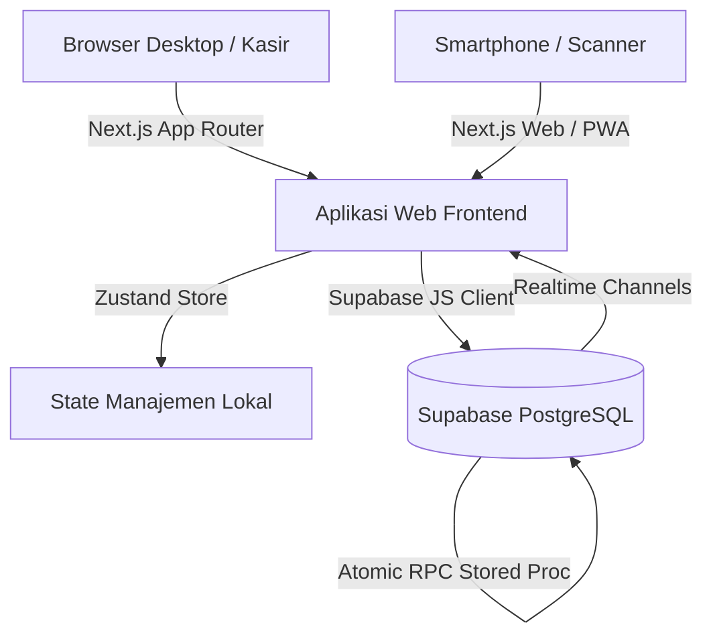

# 📋 02 — TEMPLATE PROMPT & FILE SIAP PAKAI (COPY-PASTE READY)

> Kumpulan prompt dan template dokumen standar industri yang telah teruji dalam proyek **TokoKu**. 
> Gunakan file ini sebagai "contekan" langsung saat membangun aplikasi web baru bersama AI Agent.

---

## DAFTAR ISI

1. [Katalog Prompt Siap Salin (Per Fase Kerja)](#1-katalog-prompt-siap-salin-per-fase-kerja)
   - [Prompt 1: Brainstorming & Interview Awal Mendalam](#prompt-1-brainstorming--interview-awal-mendalam)
   - [Prompt 2: Evaluasi Tech Stack & Trade-off](#prompt-2-evaluasi-tech-stack--trade-off)
   - [Prompt 3: Perumusan Design System & Aturan Visual Ketat](#prompt-3-perumusan-design-system--aturan-visual-ketat)
   - [Prompt 4: Perancangan Arsitektur & Skema Database](#prompt-4-perancangan-arsitektur--skema-database)
   - [Prompt 5: Pembuatan Roadmap & Workflow Bertahap](#prompt-5-pembuatan-roadmap--workflow-bertahap)
   - [Prompt 6: Breakdown Tugas Kecil & Kriteria Verifikasi](#prompt-6-breakdown-tugas-kecil--kriteria-verifikasi)
   - [Prompt 7: Inisialisasi Aturan AI (.agents/AGENTS.md)](#prompt-7-inisialisasi-aturan-ai-agentsagentsmd)
   - [Prompt 8: Eksekusi Modul / Tahap Tertentu](#prompt-8-eksekusi-modul--tahap-tertentu)
   - [Prompt 9: Pelaporan Bug & Feedback Presisi](#prompt-9-pelaporan-bug--feedback-presisi)
   - [Prompt 10: Pembuatan Struk / Bukti Gambar Digital](#prompt-10-pembuatan-struk--bukti-gambar-digital)
   - [Prompt 11: Pembuatan Generator Data Dummy Realistis](#prompt-11-pembuatan-generator-data-dummy-realistis)
   - [Prompt 12: Audit Keamanan & Autentikasi Pra-Deploy](#prompt-12-audit-keamanan--autentikasi-pra-deploy)
   - [Prompt 13: Perapian Repositori & Dokumentasi Akhir](#prompt-13-perapian-repositori--dokumentasi-akhir)
   - [Prompt 14: Handover Sesi Chat Baru](#prompt-14-handover-sesi-chat-baru)
2. [Template File Siap Pakai (File Boilerplates)](#2-template-file-siap-pakai-file-boilerplates)
   - [Template A: `.agents/AGENTS.md`](#template-a-agentsagentsmd)
   - [Template B: `docs/MASTER_PROJECT_CONTEXT.md`](#template-b-docsmaster_project_contextmd)
   - [Template C: `docs/WORKFLOW.md`](#template-c-docsworkflowmd)
   - [Template D: `docs/RANCANGAN_ARSITEKTUR.md`](#template-d-docsrancangan_arsitekturmd)
   - [Template E: `docs/BREAKDOWN_TUGAS_DAN_TESTING.md`](#template-f-docsbreakdown_tugas_dan_testingmd)
   - [Template F: `docs/PANDUAN_DESIGN_SYSTEM.md`](#template-g-docspanduan_design_systemmd)
   - [Template G: `docs/BACKLOG.md`](#template-h-docsbacklogmd)
   - [Template H: `.gitignore` Standar](#template-i-gitignore-standar)
   - [Template I: `README.md` Profesional](#template-j-readmemd-profesional)

---

## 1. KATALOG PROMPT SIAP SALIN (PER FASE KERJA)

### Prompt 1: Brainstorming & Interview Awal Mendalam
> **Kapan digunakan:** Prompt paling pertama di sesi awal, sebelum AI menyentuh kode apa pun.

```markdown
Halo! Aku punya ide untuk membangun sebuah aplikasi baru bernama [NAMA_APLIKASI].
Aplikasi ini bertujuan untuk [JELASKAN_TUJUAN_SINGKAT].
Calon penggunanya adalah [JELASKAN_TARGET_PENGGUNA].

ATURAN UTAMA SEKARANG:
1. JANGAN MENULIS KODE ATAU MEMBUAT FILE IMPLEMENTASI APAPUN DULU.
2. Aku ingin kita melakukan sesi BRAINSTORMING dan INTERVIEW mendalam terlebih dahulu agar kamu benar-benar paham seluruh konteks, aturan bisnis, dan batasan teknis.
3. Silakan ajukan minimal 20 sampai 40 pertanyaan detail kepadaku (tentang alur transaksi, peran user, penanganan edge cases, perangkat keras/layar, format laporan, dll).
4. WAJIB: Pada SETIAP nomor pertanyaan, kamu WAJIB menyertakan "Rekomendasi Jawaban" menurut best practice industri beserta alasannya, agar aku bisa memilih atau langsung menyetujuinya jika belum paham.
5. Setelah aku menjawab semua pertanyaan, kamu akan merangkum seluruh keputusan ke dalam file `docs/MASTER_PROJECT_CONTEXT.md`.

Apakah kamu siap? Silakan mulai dengan daftar pertanyaan interview-mu!
```

---

### Prompt 2: Evaluasi Tech Stack & Trade-off
> **Kapan digunakan:** Setelah interview selesai, saat menentukan kombinasi teknologi.

```markdown
Berdasarkan hasil wawancara dan kebutuhan aplikasi [NAMA_APLIKASI], tolong evaluasi pilihan tech stack terbaik untuk aplikasi ini.

Tolong berikan analisis komparasi:
1. Framework Frontend (misal: Next.js App Router vs Vite React)
2. State Management (misal: Zustand vs Redux Toolkit vs Context API)
3. Styling & UI Components (misal: Tailwind CSS + Shadcn UI vs Vanilla CSS vs Mantine)
4. Database & Backend BaaS (misal: Supabase PostgreSQL vs Firebase vs SQLite lokal)
5. Pustaka Pendukung Khusus (misal: Barcode scanner, PDF/Image generator, Charting library)

Kriteria utama:
- Free tier ramah kantong / gratis
- Ringan, performa cepat di perangkat laptop standar maupun smartphone
- Type-safe (TypeScript end-to-end)
- Mendukung sinkronisasi realtime jika dibutuhkan

Tuliskan rekomendasi final beserta alasan rasionalnya ke dalam `docs/RANCANGAN_ARSITEKTUR.md`.
```

---

### Prompt 3: Perumusan Design System & Aturan Visual Ketat
> **Kapan digunakan:** Sebelum membuat komponen UI pertama.

```markdown
Kita akan menyusun Design System untuk [NAMA_APLIKASI]. Aku ingin aplikasinya terlihat sangat profesional, modern, bersih, dan fungsional.

Aturan desain yang WAJIB dipatuhi tanpa pengecualian:
1. ZERO GRADIENTS RULE: Dilarang keras menggunakan warna gradien (gradient) di elemen apa pun! Seluruh warna harus solid, flat, elegan, dan harmonis.
2. Tentukan Color Palette baku:
   - Primary Accent: [Contoh: #6FA084 Sage Green]
   - Background Canvas: [Contoh: #F4F4F0 Cream Terang / #FAFAFA]
   - Surface / Card: [Contoh: #FFFFFF Putih Bersih]
   - Sidebar / Header Gelap: [Contoh: #2C2C2C Charcoal Gelap]
   - Border & Garis: [Contoh: #E5E7EB Abu Lembut]
   - Semantic Status: Sukses (Hijau Solid), Peringatan (Kuning/Oranye Solid), Bahaya (Merah Solid), Info (Biru Solid).
3. Tipografi: Gunakan font modern (misal: Inter / Plus Jakarta Sans). Tetapkan skala ukuran teks minimal 11px (tidak boleh ada tulisan kekecilan yang tidak terbaca).
4. Komponen Input & Form: Standarisasi seluruh input box, dropdown select, checkbox, dan modal dialog agar memiliki gaya visual seragam di seluruh aplikasi.
5. Responsivitas Layar: Desain harus tahan banting pada resolusi 1366x768, 1920x1080 dengan Windows Display Scaling 125% - 150%, serta layar smartphone.

Tolong tuangkan seluruh aturan ini ke dalam file `docs/PANDUAN_DESIGN_SYSTEM.md` dan konfigurasikan `tailwind.config.ts` serta CSS variabelnya.
```

---

### Prompt 4: Perancangan Arsitektur & Skema Database
> **Kapan digunakan:** Sebelum inisialisasi tabel database atau model data.

```markdown
Tolong buatkan rancangan arsitektur data lengkap untuk database Supabase (PostgreSQL) proyek [NAMA_APLIKASI].

Rancangan harus mencakup:
1. Diagram Relasi Entitas (ERD) berbasis format Mermaid Markdown.
2. Skrip DDL SQL lengkap (CREATE TABLE, PRIMARY KEY, FOREIGN KEY, INDEX, CHECK constraint).
3. Aturan pencegahan data tidak valid (misal: stok tidak boleh negatif, harga tidak boleh < 0).
4. Skrip Stored Procedure / RPC PostgreSQL untuk transaksi atomic yang melibatkan banyak tabel (misal: checkout kasir yang memotong stok dan mencatat riwayat dalam 1 transaksi ACID).
5. Aturan Row Level Security (RLS) untuk memisahkan data berdasarkan hak akses (Role-Based Access Control).
6. Skrip Realtime Channel publication untuk tabel yang membutuhkan sinkronisasi instan (misal: antrean scanner HP ke kasir laptop).

Tulis seluruh rancangan dan script SQL ini ke dalam `docs/RANCANGAN_ARSITEKTUR.md` dan siapkan file migrasi SQL bersih di folder `supabase/migrations/`.
```

---

### Prompt 5: Pembuatan Roadmap & Workflow Bertahap
> **Kapan digunakan:** Untuk menetapkan rute pengerjaan agar terarah per vertical slice.

```markdown
Berdasarkan seluruh dokumen arsitektur dan konteks, buatkan file `docs/WORKFLOW.md` yang membagi pengerjaan aplikasi menjadi beberapa fase/tahapan logis (Vertical Slice).

Prinsip pembagian tahap:
- Fase 0: Setup environment, base template, Git, dan Design System tokens.
- Fase 1..N: Setiap fase harus menyelesaikan 1 fitur/modul secara tuntas dari database -> server/API -> state management -> tampilan UI -> verifikasi pengujian.
- Jangan membuat tahap yang membagi "semua frontend dulu lalu semua backend nanti". Selesaikan modul demi modul secara utuh.
- Sertakan estimasi prioritas dan dependensi antar modul.

Simpan dokumen ini di `docs/WORKFLOW.md`.
```

---

### Prompt 6: Breakdown Tugas Kecil & Kriteria Verifikasi
> **Kapan digunakan:** Menjelang eksekusi koding, untuk memastikan setiap sub-fitur terukur.

```markdown
Tolong ambil seluruh tahapan dari `docs/WORKFLOW.md` dan pecah menjadi sub-tugas yang sangat rinci ke dalam `docs/BREAKDOWN_TUGAS_DAN_TESTING.md`.

Format untuk setiap sub-tugas WAJIB mencakup:
1. Checkbox status: `- [ ] N.X Nama Sub-Tugas`
2. Deskripsi fungsionalitas yang dibangun.
3. Kriteria Selesai (Definition of Done) yang terukur.
4. Cara Menguji (Verification Step): Skenario manual (langkah klik di UI) dan skenario validasi data.
5. Titik potensi kegagalan (edge case) yang harus diantisipasi.

Pastikan dokumen ini menjadi checklist utama yang kita centang satu per satu selama pengerjaan.
```

---

### Prompt 7: Inisialisasi Aturan AI (.agents/AGENTS.md)
> **Kapan digunakan:** Untuk mengunci SOP AI agar tidak lupa konteks antar sesi chat.

```markdown
Tolong buatkan file konfigurasi operasional AI di folder `.agents/AGENTS.md` (dan buat symlink atau salinan ke `.agents/GEMINI.md` jika menggunakan Gemini).

Aturan yang harus dicantumkan di dalamnya:
1. IDENTITAS USER: Nama user adalah [NAMA_USER]. AI WAJIB menyapa dengan "[NAMA_USER], ..." di setiap awal pesan.
2. DOKUMENTASI WAJIB: Sebelum merespons tugas apa pun, AI harus membaca dokumen acuan: `docs/MASTER_PROJECT_CONTEXT.md`, `docs/WORKFLOW.md`, `docs/RANCANGAN_ARSITEKTUR.md`, `docs/BREAKDOWN_TUGAS_DAN_TESTING.md`, dan `docs/PANDUAN_DESIGN_SYSTEM.md`.
3. AUTOMATED COMMIT & PUSH POLICY: Setiap kali AI menyelesaikan satu unit tugas, perbaikan bug, atau pembaruan dokumen, AI WAJIB otomatis menjalankan:
   `git add .`
   `git commit -m "<type>(<scope>): <subject in English>"`
   `git push`
4. ATURAN DESAIN KETAT: Zero gradients, solid color tokens, font minimum 11px, responsive modal dengan overflow-y auto.
5. NO UNREQUESTED FEATURES: Jangan mengarang fitur baru tanpa persetujuan. Jika ada keraguan atau pilihan teknis, selalu tanyakan dengan opsi dan rekomendasi.
6. VERIFIKASI SEBELUM SELESAI: Wajib menjalankan build check (`npm run build`) dan verifikasi tampilan visual.
```

---

### Prompt 8: Eksekusi Modul / Tahap Tertentu
> **Kapan digunakan:** Memulai pengerjaan salah satu modul spesifik.

```markdown
Oke, mari kita mulai mengerjakan [FASE_X: NAMA_MODUL] sesuai dengan checklist di `docs/BREAKDOWN_TUGAS_DAN_TESTING.md`.

Alur pengerjaan yang harus kamu ikuti:
1. Baca kembali kriteria selesai dan cara pengujian untuk sub-tugas ini.
2. Jelaskan rencana langkah teknis yang akan kamu lakukan secara singkat.
3. Kerjakan implementasi kode (database schema / store / UI component).
4. Jalankan validasi `npm run build` untuk memastikan tidak ada kesalahan tipe TypeScript atau impor rusak.
5. Verifikasi tampilan di browser lokal.
6. Jika semua lolos, lakukan auto-commit dan auto-push dengan conventional commit format.
7. Centang checkbox yang selesai di file breakdown dan berikan laporan hasil beserta instruksi cara mengujinya untukku.
```

---

### Prompt 9: Pelaporan Bug & Feedback Presisi
> **Kapan digunakan:** Saat kamu menguji aplikasi dan menemukan hal yang salah/rusak.

```markdown
Aku baru saja menguji [NAMA_MODUL / HALAMAN] dan menemukan beberapa masalah berikut:

1. [LOKASI/KOMPONEN]: [Deskripsi apa yang terjadi].
   - Yang diharapkan: [Deskripsi yang seharusnya terjadi].
   - Kondisi layar saat pengujian: Resolusi 1920x1080, Windows scaling 150%, zoom browser 100%.
   - Pesan error (jika ada di console/terminal): [Tempelkan teks error di sini].

2. [LOKASI/KOMPONEN]: [Masalah kedua].
   - Yang diharapkan: [Ekspektasi].

Tolong lakukan:
- Identifikasi akar masalah (root cause) tanpa membuat asumsi terburu-buru.
- Perbaiki kodenya tanpa merusak fitur lain yang sudah berjalan.
- Uji ulang dengan `npm run build`.
- Lakukan auto-commit & push jika sudah aman.
```

---

### Prompt 10: Pembuatan Struk / Bukti Gambar Digital
> **Kapan digunakan:** Jika aplikasi membutuhkan fitur ekspor nota/invoice ke format gambar (PNG) dan kirim ke WhatsApp.

```markdown
Tolong buatkan fitur Struk Digital Gambar (High-Resolution PNG) untuk transaksi kasir:
1. Desain Struk:
   - Tampilan bersih, flat, elegan (ala bukti transfer bank digital).
   - Tampilkan logo, nama toko, alamat, invoice number, nama kasir, tanggal & jam, daftar produk (nama, qty, harga, subtotal), total bayar, metode pembayaran, uang diterima, dan kembalian.
   - Sertakan barcode invoice atau QR code verifikasi di bagian bawah struk.
2. Mekanisme Render Gambar:
   - Gunakan `html2canvas` atau `modern-screenshot` dengan device scale factor 2x atau 3x agar teks tajam dan tidak pecah saat diperbesar.
   - Atasi isu layout: Gunakan fixed width container (misal: 380px), hindari properti CSS yang sering membuat kanvas terpotong (seperti `overflow: hidden` pada parent fleksibel atau scaling font dinamis).
3. Mekanisme Berbagi:
   - Tombol "Unduh Gambar Struk" (Blob download).
   - Tombol "Bagikan ke WhatsApp":
     * Prioritaskan `navigator.share` (Web Share API) jika didukung perangkat (agar langsung memunculkan drawer aplikasi WA dengan lampiran foto).
     * Jika tidak didukung (misal browser desktop tanpa file share), sediakan tombol otomatis unduh gambar dan salin pesan ringkasan teks + direct link `wa.me/[NOMOR]`.
```

---

### Prompt 11: Pembuatan Generator Data Dummy Realistis
> **Kapan digunakan:** Saat modul UI selesai dan butuh diisi data nyata untuk pengujian visual & laporan.

```markdown
Tolong buatkan script seed / generator data dummy yang REALISTIS untuk [NAMA_APLIKASI]:
1. Data tidak boleh menggunakan teks acak seperti "Lorem ipsum" atau "Produk 1, Produk 2".
2. Gunakan nama barang, barcode valid (EAN-13), harga jual, harga modal, kategori, dan stok yang masuk akal di dunia nyata.
3. Buatkan data riwayat transaksi minimal untuk 30 hari ke belakang dengan variasi jam belanja, metode pembayaran (Tunai & QRIS), dan kuantitas realistis agar grafik laporan tren terlihat dinamis dan memiliki pola penjualan yang meyakinkan.
4. Sediakan tombol / script pemulihan ("Reset Data Dummy" & "Hapus Semua Data Transaksi") agar database bisa dibersihkan kembali saat pengujian selesai.
```

---

### Prompt 12: Audit Keamanan & Autentikasi Pra-Deploy
> **Kapan digunakan:** Sebelum mendeploy aplikasi ke Vercel atau server publik.

```markdown
Aplikasi kita sudah hampir selesai dan akan segera dideploy ke publik. Sekarang kita WAJIB melakukan Security Review & Production Hardening:

Tolong periksa dan perbaiki:
1. Role-Based Access Control (RBAC):
   - Pastikan rute yang hanya boleh diakses peran tertentu (misal: `/laporan`, `/pengaturan`) terlindungi secara ketat di level middleware dan server-side, bukan sekadar menyembunyikan tombol di UI.
   - Kasir tidak boleh bisa mengakses data laporan keuangan atau mengubah harga modal barang secara langsung lewat inspect API.
2. Sanitasi Input & SQL Injection: Pastikan seluruh input form divalidasi dengan Zod schema dan query Supabase menggunakan parameterized calls.
3. Pembersihan Credentials:
   - Pastikan tidak ada secret API key (seperti `service_role_key` atau password DB) yang bocor di kode client-side / file commit Git.
   - Pastikan seluruh variabel rahasia hanya dipanggil lewat `.env.local` yang masuk ke `.gitignore`.
4. Fallback Offline / Mock Mode: Pastikan aplikasi memiliki penanganan error yang anggun (graceful degradation) jika koneksi database terputus.
```

---

### Prompt 13: Perapian Repositori & Dokumentasi Akhir
> **Kapan digunakan:** Saat aplikasi sudah beres secara fitur dan ingin dijadikan portofolio rapi.

```markdown
Seluruh fitur aplikasi sudah selesai dan teruji. Sekarang tolong bersihkan dan rapikan repositori ini agar terlihat sangat rapi dan berstandar industri:

Langkah kerja:
1. Pastikan folder root bersih:
   - Pindahkan seluruh prompt dan aturan internal AI ke dalam folder `.agents/`.
   - Pindahkan seluruh dokumen arsitektur dan panduan ke dalam folder `docs/`.
   - Pastikan tidak ada file sementara (.tmp, test script usang, skrip scratch) yang tertinggal di root.
2. Buatkan file `README.md` utama yang memukau:
   - Banner judul, deskripsi proyek, live demo link, cuplikan screenshot antarmuka.
   - Daftar fitur unggulan.
   - Tech stack yang digunakan beserta alasannya.
   - Panduan instalasi lokal langkah demi langkah (clone, install, env setup, dev).
   - Struktur folder proyek.
3. Periksa semua link markdown di dalam folder `docs/` agar tidak ada link file yang patah (broken links).
4. Lakukan final build check (`npm run build`), lalu commit dengan pesan: `docs: finalize documentation, architecture blueprints, and clean repository structure`.
```

---

### Prompt 14: Handover Sesi Chat Baru
> **Kapan digunakan:** Saat kamu membuka chat room baru di AI agar AI langsung menyambung tanpa amnesia.

```markdown
Halo! Kita melanjutkan pengerjaan proyek [NAMA_APLIKASI].
Ini adalah sesi chat baru.

Sebelum kamu menjawab apa pun, tolong baca dan sinkronkan pemahamanmu dengan dokumen-dokumen berikut di repository:
1. `.agents/AGENTS.md` (aturan operasional, greeting, dan commit policy)
2. `docs/MASTER_PROJECT_CONTEXT.md` (konteks proyek dan peran pengguna)
3. `docs/WORKFLOW.md` (roadmap pengerjaan)
4. `docs/BREAKDOWN_TUGAS_DAN_TESTING.md` (status pengerjaan saat ini)

Status terakhir: Kita sedang berada di [SEBUTKAN_FASE_ATAU_MODUL_TERAKHIR].
Tolong berikan konfirmasi ringkas bahwa kamu sudah membaca semua dokumen di atas dan siap melanjutkan tugas berikutnya!
```

---

## 2. TEMPLATE FILE SIAP PAKAI (FILE BOILERPLATES)

Berikut adalah template isi file yang bisa langsung kamu salin ke proyek baru.

---

### Template A: `.agents/AGENTS.md`
> Simpan file ini di: `.agents/AGENTS.md`

```markdown
# 🤖 AGENTS & AI ASSISTANT OPERATING RULES — [NAMA_PROYEK]

Dokumen ini mengatur perilaku operasional, retensi konteks, dan alur kerja otomatis untuk semua asisten AI yang bekerja di repositori ini.

---

## 1. USER IDENTITY & GREETING RULE (STRICT)
* **User's Name:** [NAMA_KAMU]
* **MANDATORY GREETING:** Kamu WAJIB memulai SETIAP respons dengan memanggil nama **"[NAMA_KAMU],"** (contoh: `[NAMA_KAMU], ...`). Jangan pernah menghilangkan sapaan ini.

---

## 2. CONTEXT & INTERLINKED DOCUMENTATION MAP
Sebelum menjawab pertanyaan atau mengeksekusi tugas apa pun, AI WAJIB membaca dan menyelaraskan pemikiran dengan dokumen-dokumen berikut:
- 📜 **Master Context:** [docs/MASTER_PROJECT_CONTEXT.md](../docs/MASTER_PROJECT_CONTEXT.md)
- 🔄 **Workflow & Roadmap:** [docs/WORKFLOW.md](../docs/WORKFLOW.md)
- 🏗️ **Architecture & Tech Specs:** [docs/RANCANGAN_ARSITEKTUR.md](../docs/RANCANGAN_ARSITEKTUR.md)
- 📋 **Task Breakdown & Testing:** [docs/BREAKDOWN_TUGAS_DAN_TESTING.md](../docs/BREAKDOWN_TUGAS_DAN_TESTING.md)
- 🎨 **Design System Guidelines:** [docs/PANDUAN_DESIGN_SYSTEM.md](../docs/PANDUAN_DESIGN_SYSTEM.md)
- 🗃️ **Backlog & Known Issues:** [docs/BACKLOG.md](../docs/BACKLOG.md)

---

## 3. AUTOMATED COMMIT & PUSH POLICY (INDUSTRY STANDARD)
* **Auto-Commit & Auto-Push:** Setiap kali asisten AI menyelesaikan satu tugas, modul, perbaikan bug, atau pembaruan dokumentasi, AI WAJIB otomatis menjalankan:
  1. `git add .`
  2. `git commit -m "<type>(<scope>): <subject in English>"`
  3. `git push`
* **Format Pesan Commit (Conventional Commits):**
  - `feat(<scope>)`: Implementasi fitur baru
  - `fix(<scope>)`: Perbaikan bug atau kesalahan logika
  - `docs(<scope>)`: Pembaruan file dokumentasi
  - `style(<scope>)`: Perubahan styling, layout, atau warna token (tanpa ubah logika)
  - `refactor(<scope>)`: Restrukturisasi kode tanpa mengubah fungsionalitas
  - `test(<scope>)`: Penambahan atau perbaikan unit/e2e test
  - `chore(<scope>)`: Konfigurasi dependensi, build tooling, gitignore

---

## 4. DESIGN & ARCHITECTURE CONSTRAINTS (ZERO DEVIATION)
1. ⛔ **ZERO GRADIENTS RULE:** Dilarang keras menggunakan background atau elemen warna gradien (100% solid flat colors only).
2. **Framework & Stack:** [SEBUTKAN STACK, contoh: Next.js App Router, TypeScript, Tailwind CSS, Zustand, Supabase].
3. **No Unrequested Features:** Dilarang mengarang atau menambahkan fitur yang tidak diminta oleh [NAMA_KAMU]. Jika menemukan pilihan atau opsi solusi, SELALU tanyakan terlebih dahulu dengan menyertakan rekomendasi terbaik.
4. **Verification First:** Jalankan `npm run build` dan verifikasi visual sebelum menyatakan tugas selesai.
```

---

### Template B: `docs/MASTER_PROJECT_CONTEXT.md`
> Simpan file ini di: `docs/MASTER_PROJECT_CONTEXT.md`

```markdown
# 📜 MASTER PROJECT CONTEXT — [NAMA_PROYEK]

## 1. Ringkasan Eksekutif
* **Nama Proyek:** [NAMA_PROYEK]
* **Deskripsi Singkat:** [Aplikasi web yang dibuat untuk memecahkan masalah X bagi pengguna Y].
* **Tujuan Utama:** [Jelaskan tujuan akhir dari aplikasi ini].

---

## 2. Masalah yang Diselesaikan & Solusi
| Masalah Saat Ini | Solusi dalam Aplikasi |
|------------------|----------------------|
| [Contoh: Pencatatan stok masih manual di buku] | [Sistem inventaris digital dengan kartu stok otomatis] |
| [Contoh: Nota kertas sering hilang] | [Struk digital format gambar kirim via WhatsApp] |

---

## 3. Profil Pengguna & Hak Akses (User Roles)
1. **[Role 1, misal: Pemilik / Owner]:**
   - Akses penuh ke seluruh menu (Laporan laba rugi, manajemen pengguna, penyesuaian harga, inventaris).
2. **[Role 2, misal: Kasir / Staf]:**
   - Akses terbatas hanya ke halaman kasir (transaksi penjualan, riwayat nota harian, cek stok produk).
   - Dilarang mengakses laporan keuntungan atau menghapus data master.

---

## 4. Ruang Lingkup Fitur (MoSCoW Matrix)
* **MUST HAVE (Wajib Ada di V1):**
  - [Fitur 1]
  - [Fitur 2]
  - [Fitur 3]
* **SHOULD HAVE (Sangat Penting Jika Memungkinkan):**
  - [Fitur 4]
  - [Fitur 5]
* **COULD HAVE (Bagus Jika Ada, Tapi Bisa Ditunda):**
  - [Fitur 6]
* **WON'T HAVE (Dilarang Dibuat di Tahap Ini):**
  - [Fitur yang sengaja tidak dibuat agar scope tidak bengkak]

---

## 5. Aturan Bisnis Kunci (Core Business Rules)
1. [Contoh Aturan 1: Stok barang tidak boleh bernilai negatif (< 0)].
2. [Contoh Aturan 2: Pembulatan harga harus dalam kelipatan Rp 500 atau Rp 1.000].
3. [Contoh Aturan 3: Transaksi yang sudah tersimpan hanya bisa dibatalkan oleh peran Owner].

---

## 6. Batasan & Lingkungan Operasional
* **Target Perangkat:** Laptop layar 14 inci (1366x768 & 1920x1080) dan Smartphone Android (Chrome Mobile).
* **Budget Infrastruktur:** 100% Free Tier (Vercel Hobby + Supabase Free).
* **Koneksi Jaringan:** Optimal online, toleran terhadap jaringan lambat.
```

---

### Template C: `docs/WORKFLOW.md`
> Simpan file ini di: `docs/WORKFLOW.md`

```markdown
# 🔄 WORKFLOW & ROADMAP TAHAPAN — [NAMA_PROYEK]

Dokumen ini membagi pengerjaan proyek menjadi tahapan vertikal (Vertical Slices) yang terstruktur dan teruji.

---

## Tahap 0: Setup Repositori, Stack, & Design System Fondasi
- Inisialisasi project, TypeScript, Tailwind CSS, icon pack, dan state store.
- Setup file `.agents/AGENTS.md` dan `.gitignore`.
- Konfigurasi token warna solid dan tipografi di `tailwind.config.ts`.
- Inisialisasi koneksi database / BaaS.

---

## Tahap 1: Fondasi Autentikasi & Navigasi Utama (AppShell)
- Halaman login role-based sederhana.
- Layout AppShell: Sidebar navigasi responsif, Header informasi kasir/toko, dan Mobile Drawer.
- Guard proteksi rute berbasis peran pengguna.

---

## Tahap 2: [Modul Inti 1 - misal: Master Data & Inventaris]
- Tabel data dengan pencarian instan, filter kategori, dan pagination.
- Modal tambah, edit, dan hapus data dengan validasi form Zod.
- Modal penyesuaian cepat (Stock Opname / Quick adjust).

---

## Tahap 3: [Modul Inti 2 - misal: Terminal Transaksi / POS Kasir]
- Grid katalog produk responsif + keranjang belanja Zustand.
- Input pembayaran, tombol uang pas/pecahan cepat, dan hitung kembalian otomatis.
- Validasi checkout atomic (simpan transaksi + potong stok di database).

---

## Tahap 4: [Modul Inti 3 - misal: Riwayat & Struk Digital WhatsApp]
- Tabel riwayat transaksi dengan filter rentang tanggal.
- Generator struk digital format PNG resolusi tinggi.
- Integrasi Web Share API dan WhatsApp direct link.

---

## Tahap 5: [Modul Inti 4 - misal: Dashboard Laporan & Analisis]
- Kartu metrik ringkasan (Total Penjualan, Keuntungan Bersih, Transaksi Hari Ini).
- Grafik batang tren harian/bulanan dan diagram donat proporsi penjualan.
- Ekspor laporan ke format Excel/CSV.

---

## Tahap 6: Pengujian Menyeluruh, Hardening, & Deployment
- Pengujian data dummy 30 hari.
- Verifikasi build produksi (`npm run build`).
- Deployment ke hosting publik (Vercel) & verifikasi koneksi cloud.
- Pembersihan repositori & penyusunan dokumentasi akhir.
```

---

### Template D: `docs/RANCANGAN_ARSITEKTUR.md`
> Simpan file ini di: `docs/RANCANGAN_ARSITEKTUR.md`

```markdown
# 🏗️ RANCANGAN ARSITEKTUR & TEKNOLOGI — [NAMA_PROYEK]

## 1. Diagram Arsitektur Sistem


---

## 2. Struktur Direktori Proyek (Project Folder Structure)
```text
├── .agents/
│   └── AGENTS.md                  # Aturan operasional AI
├── docs/
│   ├── MASTER_PROJECT_CONTEXT.md  # Konteks bisnis
│   ├── WORKFLOW.md                # Roadmap pengerjaan
│   ├── RANCANGAN_ARSITEKTUR.md    # Dokumen ini
│   ├── BREAKDOWN_TUGAS_DAN_TESTING.md # Checklist verifikasi
│   ├── PANDUAN_DESIGN_SYSTEM.md   # Desain tokens
│   └── BACKLOG.md                 # Isu & ide ditunda
├── src/
│   ├── app/                       # Next.js App Router pages
│   │   ├── (auth)/login/
│   │   ├── (dashboard)/
│   │   │   ├── pos/
│   │   │   ├── inventaris/
│   │   │   ├── riwayat/
│   │   │   └── laporan/
│   │   └── layout.tsx
│   ├── components/                # Komponen UI modular
│   │   ├── layout/                # Sidebar, Header, AppShell
│   │   ├── ui/                    # Tombol, Dialog, Input standar
│   │   └── [modul]/               # Komponen spesifik modul
│   ├── lib/                       # Helper, Supabase client, utils
│   ├── store/                     # Zustand stores
│   └── types/                     # TypeScript interfaces
├── public/                        # Aset statis
├── supabase/                      # Skrip SQL migrasi
└── tailwind.config.ts             # Token warna & layout
```

---

## 3. Skema Basis Data (Database Schema DDL)
```sql
-- ENUM TIPE
CREATE TYPE user_role AS ENUM ('owner', 'cashier');
CREATE TYPE payment_method AS ENUM ('cash', 'qris', 'transfer');

-- 1. TABEL PENGGUNA
CREATE TABLE users (
    id UUID PRIMARY KEY DEFAULT gen_random_uuid(),
    username TEXT UNIQUE NOT NULL,
    full_name TEXT NOT NULL,
    role user_role NOT NULL DEFAULT 'cashier',
    pin_hash TEXT NOT NULL,
    created_at TIMESTAMPTZ DEFAULT NOW()
);

-- 2. TABEL KATEGORI
CREATE TABLE categories (
    id UUID PRIMARY KEY DEFAULT gen_random_uuid(),
    name TEXT UNIQUE NOT NULL,
    icon_name TEXT DEFAULT 'Folder'
);

-- 3. TABEL PRODUK
CREATE TABLE products (
    id UUID PRIMARY KEY DEFAULT gen_random_uuid(),
    category_id UUID REFERENCES categories(id) ON DELETE SET NULL,
    barcode TEXT UNIQUE,
    name TEXT NOT NULL,
    cost_price NUMERIC(12, 2) NOT NULL DEFAULT 0,
    selling_price NUMERIC(12, 2) NOT NULL,
    current_stock INT NOT NULL DEFAULT 0 CHECK (current_stock >= 0),
    min_stock_alert INT NOT NULL DEFAULT 5,
    unit TEXT NOT NULL DEFAULT 'pcs',
    created_at TIMESTAMPTZ DEFAULT NOW(),
    updated_at TIMESTAMPTZ DEFAULT NOW()
);

-- 4. TABEL TRANSAKSI PENJUALAN
CREATE TABLE transactions (
    id UUID PRIMARY KEY DEFAULT gen_random_uuid(),
    invoice_number TEXT UNIQUE NOT NULL,
    cashier_id UUID REFERENCES users(id),
    total_amount NUMERIC(12, 2) NOT NULL,
    payment_method payment_method NOT NULL DEFAULT 'cash',
    cash_paid NUMERIC(12, 2) NOT NULL,
    change_due NUMERIC(12, 2) NOT NULL DEFAULT 0,
    created_at TIMESTAMPTZ DEFAULT NOW()
);

-- 5. TABEL DETAIL TRANSAKSI
CREATE TABLE transaction_items (
    id UUID PRIMARY KEY DEFAULT gen_random_uuid(),
    transaction_id UUID REFERENCES transactions(id) ON DELETE CASCADE,
    product_id UUID REFERENCES products(id),
    quantity INT NOT NULL CHECK (quantity > 0),
    unit_cost_price NUMERIC(12, 2) NOT NULL,
    unit_selling_price NUMERIC(12, 2) NOT NULL,
    subtotal NUMERIC(12, 2) NOT NULL
);
```
```

---

### Template E: `docs/BREAKDOWN_TUGAS_DAN_TESTING.md`
> Simpan file ini di: `docs/BREAKDOWN_TUGAS_DAN_TESTING.md`

```markdown
# 📋 BREAKDOWN TUGAS & VERIFIKASI PENGUJIAN — [NAMA_PROYEK]

Format: Beri tanda centang `[x]` hanya jika tugas sudah diuji secara visual dan lolos build.

---

### 🚀 FASE 0: Inisialisasi & Setup Lingkungan
- [ ] **0.1 Setup Repository & Tooling**
  - Kriteria: Repo siap, dependensi terinstall, `npm run dev` jalan tanpa error.
  - Cara Uji: Jalankan server dev dan buka di localhost.
- [ ] **0.2 Desain Tokens & Basis Styling**
  - Kriteria: Warna solid baku terdefinisi di Tailwind tanpa ada gradien.
  - Cara Uji: Periksa file config dan buat halaman sampel palet warna.

---

### 🛡️ FASE 1: Autentikasi & Shell Navigasi
- [ ] **1.1 Login Page & User Store**
  - Kriteria: Login berhasil menyimpan state pengguna di Zustand & localStorage.
  - Cara Uji: Coba login sebagai Owner dan Kasir, pastikan status tersimpan.
- [ ] **1.2 AppShell & Sidebar Responsif**
  - Kriteria: Sidebar bisa collapse, drawer mobile berfungsi di layar kecil (<768px).
  - Cara Uji: Resize jendela browser dari desktop ke mobile emulator.

---

### 📦 FASE 2: Modul Master Data Produk
- [ ] **2.1 Tabel Produk & Filter Pencarian**
  - Kriteria: Pencarian instan berdasarkan nama dan barcode merespons < 200ms.
  - Cara Uji: Ketik sebagian nama produk, pastikan daftar otomatis terfilter.
- [ ] **2.2 Modal Tambah & Edit Produk**
  - Kriteria: Validasi input harga > 0, stok >= 0, barcode unik.
  - Cara Uji: Coba simpan produk dengan form kosong dan verifikasi pesan error muncul.

---

### 💳 FASE 3: Modul Terminal Kasir (POS)
- [ ] **3.1 Keranjang Belanja Zustand**
  - Kriteria: Tambah item, ubah qty (+/-), hapus item, hitung total harga otomatis.
  - Cara Uji: Klik beberapa kartu produk, ubah jumlah, pastikan total terhitung akurat.
- [ ] **3.2 Modal Pembayaran & Kembalian**
  - Kriteria: Tombol uang pas, tombol pecahan cepat, hitung uang kembalian.
  - Cara Uji: Masukkan uang kurang -> tombol bayar wajib dinonaktifkan.

---

### 🧾 FASE 4: Riwayat & Struk Digital
- [ ] **4.1 Generator Struk Gambar (PNG)**
  - Kriteria: Gambar struk ter-render tajam tanpa terpotong di tepi kanan/bawah.
  - Cara Uji: Klik unduh struk, buka file gambar PNG hasil unduhan di image viewer.
- [ ] **4.2 Integrasi WhatsApp Share**
  - Kriteria: Membuka Web Share API pada mobile atau direct chat `wa.me` pada desktop.
  - Cara Uji: Klik tombol kirim WA dan periksa format pesan yang dihasilkan.

---

### 📊 FASE 5: Laporan & Analitik Penjualan
- [ ] **5.1 Kartu Ringkasan Metrik (KPIs)**
  - Kriteria: Menampilkan omzet, profit, dan total transaksi sesuai rentang filter tanggal.
  - Cara Uji: Bandingkan total di kartu KPI dengan penjumlahan manual di tabel riwayat.
- [ ] **5.2 Visualisasi Grafik**
  - Kriteria: Grafik batang/garis muncul dengan tinggi pasti (tidak gepeng / 0px).
  - Cara Uji: Buka halaman laporan pada layar desktop dan laptop scaling 150%.
```

---

### Template F: `docs/PANDUAN_DESIGN_SYSTEM.md`
> Simpan file ini di: `docs/PANDUAN_DESIGN_SYSTEM.md`

```markdown
# 🎨 PANDUAN DESIGN SYSTEM & UI/UX — [NAMA_PROYEK]

## 1. Filosofi Desain
* **Flat, Solid, & Functional:** Tidak ada ornamen visual yang berlebihan. Utamakan kecepatan pemahaman informasi dan responsivitas interaksi.
* **ZERO GRADIENTS RULE:** Dilarang keras menggunakan background warna gradien di mana pun. Seluruh warna harus 100% solid.

---

## 2. Palet Warna Baku (Color Tokens)

| Peran Warna | Hex Code | Nama Token Tailwind | Penggunaan |
|-------------|----------|---------------------|------------|
| Primary Accent | `#6FA084` | `sage-600` | Tombol utama, badge aktif, aksen penting |
| Primary Hover | `#5A8B6F` | `sage-700` | State hover tombol utama |
| Canvas Background | `#F4F4F0` | `cream-50` | Background seluruh aplikasi |
| Surface / Card | `#FFFFFF` | `white` | Kartu konten, modal dialog, popover |
| Dark Header / Sidebar | `#2C2C2C` | `charcoal-900` | Sidebar navigasi dan header atas |
| Border / Separator | `#E5E7EB` | `gray-200` | Garis pembatas tabel dan kartu |
| Text Primary | `#1F2937` | `gray-800` | Tulisan utama dan judul |
| Text Muted | `#6B7280` | `gray-500` | Label pembantu, timestamp, placeholder |
| Status Success | `#10B981` | `emerald-500` | Stok aman, transaksi berhasil |
| Status Warning | `#F59E0B` | `amber-500` | Stok menipis, peringatan |
| Status Danger | `#EF4444` | `rose-500` | Stok habis, hapus data, stok minus |

---

## 3. Standar Tipografi
* **Font Utama:** Inter / Plus Jakarta Sans.
* **Ukuran Minimal:** **11px** (`text-[11px]`). Dilarang memakai teks di bawah 11px karena tidak terbaca pada layar laptop standar atau dari jarak kasir berdiri.
* **Hierarki Tipografi:**
  - Angka Nilai Uang / Total: `28px` - `32px` (`text-2xl` - `text-3xl font-extrabold`)
  - Judul Halaman: `20px` (`text-xl font-bold`)
  - Judul Kartu / Modal: `16px` (`text-base font-semibold`)
  - Isi Tabel & Teks Standar: `14px` (`text-sm`)
  - Label Form & Keterangan: `12px` (`text-xs`)

---

## 4. Standar Modal & Form Dialog
1. **Batas Tinggi:** Seluruh modal WAJIB memiliki `max-h-[90vh]` atau `max-h-[85vh]` untuk mencegah tombol footer terdorong ke luar layar pada laptop display scaling 125%-150%.
2. **Struktur Modal:**
   - **Header:** Judul dan tombol close (X) tetap di atas (sticky).
   - **Body:** Area isi form yang bisa digulir (`overflow-y-auto pr-2`).
   - **Footer:** Tombol aksi (Batal & Simpan) tetap di bawah (sticky) dan selalu terlihat tanpa harus digulir.
```

---

### Template G: `docs/BACKLOG.md`
> Simpan file ini di: `docs/BACKLOG.md`

```markdown
# 🗃️ BACKLOG & ISSUE TRACKER — [NAMA_PROYEK]

Gunakan file ini untuk mencatat bug kecil, saran UI yang belum sempat dikerjakan, atau fitur masa depan agar tidak mengganggu fokus tahap berjalan.

---

## 🐛 Bug Teridentifikasi (Perlu Diperbaiki)
- [ ] **BUG-01:** [Deskripsi bug yang ditemukan saat testing].
  - Prioritas: [Tinggi / Sedang / Rendah]
  - Solusi yang direncanakan: [Ide perbaikan].

---

## 💡 Ide Peningkatan & Fitur Masa Depan (V2)
- [ ] **FEAT-01:** [Ide fitur baru yang diusulkan saat pengerjaan].
- [ ] **FEAT-02:** [Dukungan multi-bahasa atau export PDF lanjutan].
```

---

### Template H: `.gitignore` Standar
> Simpan file ini di: `.gitignore`

```gitignore
# Dependencies
/node_modules
/.pnp
.pnp.js

# Testing & Coverage
/coverage

# Next.js Build Output
/.next/
/out/

# Production Build
/build
/dist

# Environment Variables (SANGAT KRUSIAL: JANGAN PERNAH DI-COMMIT)
.env
.env.local
.env.development.local
.env.test.local
.env.production.local
*.env

# Supabase Local Credentials
supabase/.branches
supabase/.temp

# Editor Directories & OS Files
.vscode/*
!.vscode/extensions.json
.idea
.DS_Store
*.pem
Thumbs.db

# Logs
npm-debug.log*
yarn-debug.log*
yarn-error.log*
```

---

### Template I: `README.md` Profesional
> Simpan file ini di: `README.md`

```markdown
# 🏪 [NAMA_PROYEK] — [Subjudul Singkat]

[](https://nextjs.org/)
[](https://www.typescriptlang.org/)
[](https://tailwindcss.com/)
[](https://supabase.com/)

> [Paragraf deskripsi yang menjelaskan apa itu aplikasi ini, siapa penggunanya, dan nilai tambah utamanya].

---

## ✨ Fitur Utama

- ⚡ **[Fitur 1]:** [Deskripsi singkat keunggulan].
- 📦 **[Fitur 2]:** [Deskripsi singkat keunggulan].
- 📱 **[Fitur 3]:** [Deskripsi singkat keunggulan].
- 🧾 **[Fitur 4]:** [Deskripsi singkat keunggulan].
- 📊 **[Fitur 5]:** [Deskripsi singkat keunggulan].

---

## 🛠️ Tech Stack

- **Frontend Framework:** Next.js (App Router), React, TypeScript
- **Styling & UI:** Tailwind CSS, Lucide Icons, Shadcn UI
- **State Management:** Zustand
- **Database & Realtime:** Supabase (PostgreSQL, Realtime Channels, Stored Procedures)
- **Image & Print Generation:** html2canvas / modern-screenshot

---

## 🚀 Memulai Proyek Secara Lokal

### 1. Kloning Repositori
```bash
git clone https://github.com/[USERNAME]/[REPO_NAME].git
cd [REPO_NAME]
```

### 2. Instalasi Dependensi
```bash
npm install
```

### 3. Konfigurasi Environment Variables
Salin file `.env.example` menjadi `.env.local`:
```bash
cp .env.example .env.local
```
Lalu isi kredensial Supabase Anda:
```env
NEXT_PUBLIC_SUPABASE_URL=https://your-project.supabase.co
NEXT_PUBLIC_SUPABASE_ANON_KEY=your-anon-key-here
```

### 4. Jalankan Server Development
```bash
npm run dev
```
Buka browser Anda di `http://localhost:3000`.

---

## 📁 Struktur Direktori
Lihat rincian lengkap arsitektur dan struktur folder di [docs/RANCANGAN_ARSITEKTUR.md](docs/RANCANGAN_ARSITEKTUR.md).

---

## 📄 Lisensi
Didistribusikan di bawah lisensi MIT. Lihat `LICENSE` untuk informasi lebih lanjut.
```
